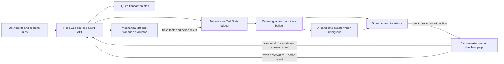
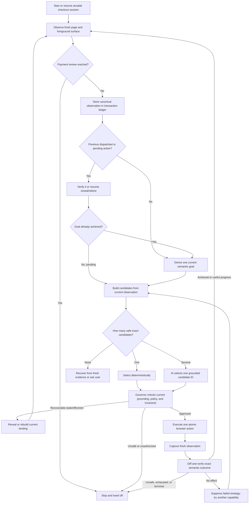
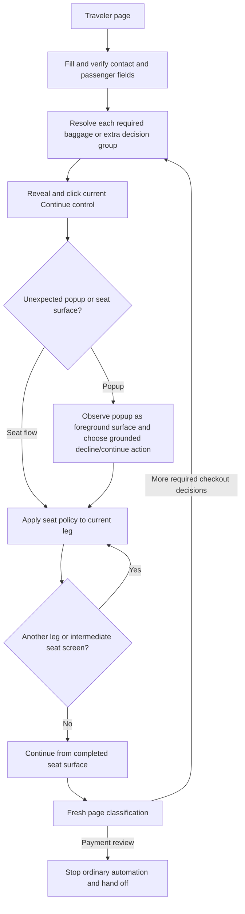

# Fly Current Codebase: Engineering Handoff

**Snapshot date:** 2026-07-20
**Code snapshot reviewed:** `041a8a7` (`dev`) plus the current uncommitted TaskState/grounded-ambiguity consolidation
**Primary roadmap:** [`AGENT_ARCHITECTURE_PLAN.md`](./AGENT_ARCHITECTURE_PLAN.md)
**Empirical progress tracker:** [`P_AGENT_ARCHITECTURE_TRACKER.md`](./P_AGENT_ARCHITECTURE_TRACKER.md)
**Ordered execution TODO:** [`FLY_EXECUTION_TODO.md`](./FLY_EXECUTION_TODO.md)

**Working-tree note:** the architecture described here includes substantial uncommitted work. On 2026-07-20, the current tree passed `npm run check`, **110/110** unit tests, and **37/37** browser/cross-layer tests. `TaskState` now controls production goal selection and navigation eligibility, legacy requirements are diagnostic-only, and policy-denied controls are model context rather than selectable candidate IDs. The newest live trace proves that consolidation is incomplete in one important way: `TaskState` owns a flat observation-scoped `currentGoal`, so an intermediate foreground surface can replace the unfinished checkout outcome. The physical-effect layer now correctly recognizes the modal close control as `dismiss_surface`, but the replacement modal goal still permits dismissal and the loop reports local success without reaching payment.

This document explains the current Fly codebase from product intent through browser execution, persistence, safety, testing, present limitations, and recommended next work. It is written for an engineer taking over the system.

If this document, the roadmap, and the tracker disagree:

1. Running code and fresh traces are the truth about behavior.
2. The tracker is the truth about what has been empirically proven.
3. The architecture plan is the desired direction and acceptance contract.

---

## 1. Executive Summary

Fly is currently a Chrome extension plus a local Node backend that attempts to take an already-selected flight checkout from traveler details to the payment-review page using a saved traveler profile and booking rules.

The long-term product vision is broader: a user states or saves preferences once, and Fly completes most airline/OTA checkouts with roughly 1–3 user interactions, despite different layouts, custom controls, popups, rerenders, add-on offers, seat flows, and other ambiguity. The same agent kernel should later support other clients, including iOS.

The present architecture is deliberately hybrid:

- Deterministic code owns observations, identity, current state, safety policy, action authorization, execution, verification, recovery limits, and the transaction ledger.
- AI is used only when the current observation contains multiple safe, grounded ways to advance and semantic judgment is genuinely needed.
- The model selects an existing current candidate ID. It does not invent selectors, arbitrary JavaScript, page-specific procedures, or transaction facts.
- The browser executor performs one small mechanical action at a time and then observes again.

The current working tree makes `task-state-reducer.js` the production semantic authority. It reduces prior durable state, fresh browser facts, the last action result, traveler data, and policy into one stage, foreground surface, decision state, completed outcomes, current goal, ambiguity state, and terminal status. The extension reports browser facts, the old requirement lifecycle is stored only as `legacyRequirementsDiagnostic`, and forward-navigation policy reads `TaskState` rather than legacy requirements. This single-authority direction is correct, but the authority currently models only one flat goal recreated from each observation. It does not yet preserve a durable transaction/stage outcome above temporary surface and action subgoals.

Ambiguous planning is also split correctly: AI can inspect all current-surface capabilities, including denied or contextual controls, but its closed output schema contains only current policy-allowed candidate IDs. The governor independently validates the chosen action afterward.

The code has reached the Gotogate payment page in a live run without a paid extra or final payment attempt. Newer runs traverse traveler details, baggage, bundle/flexible-ticket choices, both seat legs, multiple extras, offscreen recovery, and the final review surface. The newest session still loops at that surface, but it narrows the root cause: the observer continues to assign the CTA's label to the icon-only close control, while the newer physical-effect layer nevertheless identifies that actuator correctly as `dismiss_surface`. The loop persists because the reducer replaces `reach payment review` with a generic modal decision whose broad contract permits dismissal; `command_acknowledged` then accepts the local surface change and the base Continue reopens the modal.

The highest-leverage next work is therefore not payment automation, detailed seat preferences, more requirements, or an airline-specific modal handler. It is a durable hierarchical outcome model inside the existing single TaskState authority: preserve the transaction/stage outcome across intermediate surfaces, create temporary surface subgoals without replacing it, allow only effects compatible with both levels, and evaluate net progress toward the parent outcome. Command-local evidence remains a required supporting correction, but it is no longer the whole root problem.

---

## 2. Product Goal and Current Release Boundary

### Product goal

Given:

- a selected itinerary,
- a saved traveler profile,
- saved booking policies such as “no paid extras,”
- and current page evidence,

Fly should complete the checkout safely and quickly, handling unexpected page structures by observing and replanning rather than following hardcoded airline scripts.

The intended user experience is:

```text
Choose flight
→ start Fly
→ Fly completes traveler data and safe choices
→ user reviews/authorizes at meaningful risk boundaries
→ payment/booking is completed safely
```

### Current scope freeze

The current roadmap intentionally limits the first reliable vertical slice to:

- one adult traveler,
- economy travel,
- guest checkout,
- one-way or return itineraries,
- saved traveler data,
- predefined baggage policy,
- skip paid seats and paid extras by default,
- stop at payment review.

Complex multi-city trips, infants, group identity ambiguity, loyalty redemption, irregular operations, and autonomous payment are not current release requirements.

### Current terminal boundary

The current product is supposed to reach the payment page and stop. It must not autonomously:

- enter raw card credentials,
- accept legal terms,
- authorize a changed amount,
- submit the final purchase,
- or claim a booking is complete.

Those capabilities require the unfinished P0.8/P3 payment architecture: tokenized credentials, explicit offer/amount/itinerary-bound authorization, legal approval, 3-D Secure handoff, idempotency, and confirmation reconciliation.

---

## 3. Current Proven State

### What is implemented

- A Chrome Manifest V3 extension injected into supported checkout sites.
- A local web application for traveler/profile data and agent APIs.
- Durable agent sessions and an SQLite transaction ledger.
- Whole-page semantic observation, including current surfaces, controls, capabilities, validation, decision groups, pricing, and itinerary facts.
- Open shadow-root and same-origin iframe traversal; cross-origin frames remain opaque.
- Observation-bound action candidates.
- Strict model selection from current candidate IDs.
- A central action governor.
- One authoritative action lifecycle with pending-action recovery.
- One-action-at-a-time atomic browser execution.
- Fresh observation and exact post-action transition evaluation.
- Bounded recovery and user handoff.
- Static, unit, browser, and cross-layer replay coverage.
- One live Gotogate run that reached payment review.
- Newer live runs that repeatedly complete the difficult path up to the final review modal.

### What is not proven or not built

- Five consecutive Gotogate checkout-to-payment runs have not passed; there is no current consecutive acceptance streak.
- Cross-airline/OTA portability has not passed on three structurally different checkout engines.
- Backend payment-page classification and ordinary-planning suppression are implemented, but durable/sticky payment-terminal behavior has not passed repeated live acceptance.
- TaskState currently exposes one flat observation-scoped goal rather than a durable transaction/stage goal with temporary surface/action subgoals.
- Foreground surfaces can be converted into generic decision groups even when they are navigation or review surfaces rather than real mutually exclusive decisions.
- Command-local labels are not yet trustworthy. Surface/nearby text can contaminate a control's local label, although the typed physical-effect layer now recovers the close control as `dismiss_surface` in the newest run.
- Generic command verification can treat dismissal or any observable change as success even when the durable parent goal requires a specific stage transition.
- Recovery is keyed to changing current goals and does not yet detect a semantic `base → modal → base` cycle with no net parent progress.
- Production authentication, tenant isolation, and a production-grade credential vault do not exist.
- Autonomous payment, legal authorization, 3DS, final booking submission, and confirmation reconciliation are not implemented.
- iOS integration is future work; only portable shared contracts exist today.
- Latency has not yet been systematically optimized against p50/p95 targets.

### Roadmap status in plain language

- **P0 — reliable execution foundation:** materially implemented, still partial until durable parent-goal continuity, exact transition verification, cycle recovery, and repeated live acceptance pass.
- **P1 — perception/environment model:** materially implemented, still partial because decision-group evidence and control-local labels can still be polluted by surrounding surface context, and cross-engine proof is missing.
- **P2 — reusable skills/site knowledge/replay:** partial. Replay infrastructure exists; reusable knowledge and multi-engine acceptance are incomplete.
- **P3 — real transactions/payment:** not started as a production-safe capability.
- **P4 — shared kernel/iOS adapters:** architectural direction exists; product work is not started.
- **P5 — airline expansion:** not started as an accepted coverage program.

---

## 4. System Architecture



The main runtime boundaries are:

1. **Browser extension:** observes the live page and mechanically executes an approved action.
2. **Backend agent kernel:** owns semantic interpretation, action lifecycle, safety, recovery, and transaction truth.
3. **AI model:** chooses among grounded candidates when deterministic selection is insufficient.
4. **Persistence:** stores profile data separately from authoritative checkout transaction state.

### 4.1 Core components at a glance

| Component | Question it answers | What it owns |
|---|---|---|
| **Traveler profile and policy** | What does the user want? | Identity data, contact details, baggage/seat/extra preferences, price constraints, and explicit approvals. |
| **Browser observer** | What is true on the page now? | Current controls, values, validation, capabilities, surfaces, decision groups, itinerary, price, and screenshot evidence. It currently emits several overlapping name/semantic fields; command-local effect is the remaining weak boundary. |
| **TaskState reducer** | What does the current checkout mean and what remains? | Currently owns one stage, foreground surface, decisions, completions, flat current goal, ambiguity, and terminal status. It must be extended—not replaced—to preserve a durable transaction/stage outcome above temporary surface and action subgoals. |
| **Current candidate builder** | Which currently observed actions could achieve that goal? | Observation-bound candidate IDs connected to current controls, capabilities, surfaces, and expected outcomes. It correctly separates all context capabilities from policy-allowed selectable candidates. |
| **Decision selector** | Which safe candidate is best? | Deterministic selection when there is one exact answer; AI interpretation of all grounded current-surface capabilities with selection restricted to policy-allowed current candidate IDs when genuine ambiguity remains. |
| **Governor and invariants** | Is this action allowed right now? | Grounding, current-surface ownership, actionability, profile prerequisites, price/itinerary/traveler invariants, payment policy, and duplicate prevention. |
| **Reveal and rebind controller** | Can the approved target be reached after scrolling or rerendering? | Preserving the semantic action, governed scrolling, fresh observation, and binding to the equivalent current control. |
| **Atomic browser executor** | How is the approved action physically performed? | One mechanical click, type, select, keypress, or scroll. It does not decide user intent. |
| **Diff and transition evaluator** | Did the intended outcome actually happen? | Fresh before/after comparison and classification as achieved, progressed, blocked, no effect, unsafe, or uncertain. It must report both the local physical effect and net progress toward the durable parent outcome; generic command acknowledgement is still too permissive. |
| **Lifecycle and recovery controller** | What happens next? | Proposed → approved → dispatched → observed → verified state, pending work, distinct recovery strategies, budgets, continuation, or handoff. |
| **Transaction ledger** | What evidence and state survive every turn? | Immutable observations, action lifecycle, verified facts, approvals, events, and current transaction state in SQLite. |
| **User handoff boundary** | When must automation stop? | Missing user data, genuine unresolved ambiguity, exhausted safe recovery, price/itinerary conflict, payment, legal consent, or final purchase authority. |

### 4.2 Missing semantic hierarchy

TaskState should remain the single semantic authority, but it must distinguish four scopes instead of replacing one flat goal on every observation:

```text
transaction outcome: complete checkout safely
→ stage outcome: reach payment review
→ temporary surface subgoal: resolve the current review/seat/warning surface
→ atomic action: execute one grounded current capability
```

The parent outcome has a stable ID and exact postcondition that survive popups, rerenders, scrolling, and intermediate pages. A new foreground surface may add or replace the temporary surface subgoal; it may not silently complete or replace the parent outcome. Every result therefore reports two facts:

```text
local physical effect: modal dismissed
net parent progress: payment review not reached
```

AI remains useful for interpreting an unfamiliar surface and choosing among grounded policy-safe candidates. It does not own the durable transaction truth. The mechanical executor still owns only the approved click/type/select/scroll operation.

### 4.3 Authoritative agent decision loop



The loop has three non-negotiable properties:

1. **Fresh evidence before decisions.** The agent never assumes the next page will resemble the previous one.
2. **One governed action at a time.** The browser cannot run a hidden sequence that escapes verification.
3. **Semantic success, not action success.** A click only succeeds when the fresh page proves the requested outcome.

The third property is fully enforced for exact value/choice goals, but not yet for every generic command. The current final-review failure exists because modal dismissal is accepted as command acknowledgement even though the requested outcome is advancement to payment.

### 4.4 Example: navigating an airline checkout

The following is an example of how the generic loop should handle a return-flight checkout. It is an illustration, not a hardcoded airline procedure.



#### Example turn sequence

1. **Traveler form appears.**
   - Observer finds email already correct, country code wrong, phone empty, and passenger name missing.
   - Goal resolver chooses one unresolved outcome, for example `country code = +386`.
   - Candidate builder exposes the capabilities the current custom control actually supports.
   - The selector may choose type, open-and-choose, or keyboard interaction.
   - Executor performs one operation, then the fresh observation must prove `+386` and no validation error.
   - The loop advances through the remaining traveler fields without rewriting fields that are already verified.

2. **Several paid-extra cards appear.**
   - Observer groups each “No thanks / Add to cart” pair as an independent decision group.
   - User policy says no paid extras.
   - Each group gets its own semantic goal and exact free-decline verification.
   - Selecting “No thanks” for one card does not falsely complete the other cards.

3. **Continue is below the viewport.**
   - The approved semantic action is preserved.
   - The lifecycle reveals the target using the correct page or nested scroll container.
   - A fresh observation rebinds the same current Continue control.
   - Only then is Continue clicked and its page/surface transition verified.

4. **A seat modal unexpectedly opens.**
   - The modal becomes the authoritative foreground surface.
   - Background controls are temporarily ineligible.
   - Policy says no paid seats, so the candidate set favors currently observed free decline, random-free, Next, or Continue-without-seat choices.
   - The model is used only if several grounded choices remain semantically plausible.

5. **The first flight has no seat map.**
   - Observer sees aisle for 6 EUR, window for 6 EUR, and random seating for 0 EUR.
   - Policy selects the grounded 0 EUR choice.
   - Fresh evidence verifies that exact choice before Next becomes eligible.

6. **The second flight has a seat map and a warning popup.**
   - The agent does not assume the first-leg interaction applies.
   - It observes the second leg as fresh state and advances without selecting a paid seat.
   - If “Are you sure you want to continue without a seat?” appears, the popup becomes the current surface and the grounded Continue option implements the existing policy.

7. **The page rerenders or changes route.**
   - Old physical candidates are discarded.
   - Verified user outcomes remain in the ledger.
   - Current requirements and candidates are rebuilt from the fresh page.

8. **Payment page appears.**
   - URL, progress marker, heading, and sensitive payment-field evidence classify `payment_review_reached`.
   - Ordinary checkout planning stops.
   - Card entry, legal acceptance, amount authorization, and final purchase remain blocked until the future payment architecture provides explicit authority.

The same flow is intended to handle another airline with different HTML because it depends on semantic goals, current observed capabilities, fresh candidate binding, and postcondition verification—not remembered coordinates or airline step numbers.

---

## 5. Complete Runtime Flow

### 5.1 Start and session creation

The user opens a supported checkout page and presses **Start agent** in the extension sidebar.

The extension creates one durable backend session through:

```text
POST /api/agent/session
```

That session is intended to survive multiple browser actions and page transitions. The backend returns the current transaction state and uses the session ID to associate all later observations, actions, reports, screenshots, events, and ledger entries.

### 5.2 Browser observation

The extension builds a canonical observation of the current checkout state. It does not send only what is visibly on screen. It attempts to model the relevant whole page and foreground surface.

An observation includes, at minimum:

- URL and inferred checkout stage,
- page/progress headings,
- current foreground surface or modal,
- semantic controls and canonical identities,
- accessible names, roles, labels, current values, selected/disabled state,
- observed capabilities such as click, type, open, choose, keypress, or scroll,
- actionable browser actuators,
- viewport and geometry evidence,
- sections and independent decision groups,
- validation errors,
- price, currency, itinerary, and traveler evidence,
- screenshot references when visual evidence is needed.

The content script traverses normal DOM, open shadow roots, and same-origin iframes. Cross-origin iframes cannot be deeply inspected by the content script and must eventually be handled through explicit adapters or safe user handoff.

Screenshots are uploaded separately:

```text
POST /api/agent/screenshot
```

The compact structured observation is sent to:

```text
POST /api/agent/next-action
```

### 5.3 Durable recording

Before planning, the backend records the observation as immutable transaction evidence in SQLite. The current observation ID and hash become part of the action’s grounding envelope.

This distinction is important:

- **Semantic truth** persists: “decline this paid extra,” “country code must equal +386,” or “advance to payment review.”
- **Physical browser binding** is temporary: a DOM node, selector, bounding box, or candidate ID may be replaced after a rerender and must be rebound from a fresh observation.

### 5.4 Resolve previous work first

At the beginning of each turn, the loop resolves any previous dispatched or pending work before creating an unrelated plan:

```text
verify prior dispatch
→ resume pending reveal/rebind action if one exists
→ otherwise derive the next semantic goal
```

This prevents scrolling, rerendering, and modal changes from silently abandoning the original task.

### 5.5 Derive one current semantic goal

The backend derives the current obligation from:

- verified transaction state,
- user profile and booking rules,
- the current surface,
- unresolved required fields or decision groups,
- the most recent transition.

Examples:

```text
country code observed as +386
decline the current paid-extra decision group
continue from the completed seat surface
reach payment review without purchasing
```

Specialized profile or checkout helpers are meant to publish semantic goals and desired outcomes. They should not independently own scrolling, candidate selection, execution, recovery, or user handoff.

### 5.6 Build current grounded candidates

The candidate builder uses only the current stored observation. Every candidate binds:

- the semantic goal,
- a current canonical control,
- a current capability/operation,
- the current surface,
- current actionability evidence,
- an expected semantic outcome,
- and the source observation identity.

Old candidate IDs are not executable after the observation changes. If the page rerenders, the semantic goal remains but candidates must be rebuilt.

### 5.7 Select deterministically or with AI

If there is one obvious, safe, exact candidate, the backend can choose it without a model call.

If multiple current candidates could satisfy the goal, the model receives a compact semantic view and a strict set of candidate IDs. It returns a candidate ID, not arbitrary browser instructions.

Examples of appropriate AI judgment:

- deciding whether “No thanks,” “Continue without seats,” or a close button best implements “decline paid seats,”
- selecting the correct current decision group among several visually similar offers,
- choosing a grounded capability for an unusual combobox,
- interpreting a newly appeared modal or unexpected intermediate state.

AI is not supposed to:

- invent a CSS selector,
- execute page JavaScript,
- assert that an action succeeded,
- bypass price/payment policy,
- or use remembered controls from an old observation.

### 5.8 Govern the selected action

The central governor verifies the proposed action against:

- schema and action type,
- current observation ID/hash,
- current surface membership,
- canonical control and alias identity,
- observed actionability and actuator evidence,
- current semantic goal,
- traveler/profile prerequisites,
- shared booking policy,
- price, itinerary, and traveler invariants,
- payment and legal authorization,
- duplicate-action reservation.

The result is one of:

- approved,
- recoverable rejection requiring fresh binding/reselection,
- blocked by safety or missing authority,
- requires user input.

Pre-dispatch rejection is not an execution failure because the browser has not yet acted.

### 5.9 Reveal, rebind, and execute

If the target is outside the viewport or inside a scrollable container, reveal is a lifecycle substep:

```text
preserve original semantic action
→ perform governed scroll
→ observe fresh state
→ rebind by stable semantic/control identity
→ dispatch original action
```

No unrelated planner decision should occur between reveal and rebind unless the target disappeared or the page meaningfully changed.

The extension then executes exactly one mechanical operation, such as:

- `click`,
- `type`,
- `select`,
- `keypress`,
- `scroll`,
- or bounded coordinate click when explicitly grounded.

Atomic actions are not airline-specific skills. They are the universal actuator vocabulary, comparable to mouse and keyboard primitives. The intelligence lies in selecting and verifying the right primitive against the current semantic goal.

### 5.10 Fresh observation and verification

After a meaningful interaction, the extension observes again and reports browser facts through:

```text
POST /api/agent/report
```

The backend compares observation N with observation N+1. The typed diff can include:

- controls appearing, disappearing, or changing,
- selected/value changes,
- validation changes,
- modal/surface changes,
- URL/stage/progress changes,
- price or itinerary changes.

The transition evaluator classifies the action as:

- achieved,
- progressed,
- blocked,
- no effect,
- unsafe,
- uncertain.

Clicking or typing is never success by itself. Success is the expected semantic postcondition in fresh evidence, such as:

```text
observed country code = +386
and no phone validation error
```

or:

```text
the exact paid-extra decision group is now set to its free decline option
```

### 5.11 Continue, recover, or hand off

The loop repeats until the current release terminal boundary is reached.

Recovery is bounded:

- stale/pre-dispatch candidate: rebuild from current observation without consuming an execution attempt,
- offscreen control: reveal and resume,
- dispatched action with no effect: suppress that exact strategy and try another observed capability,
- useful unexpected page change: accept progress and continue from fresh state,
- changed surface/stage: reconcile requirements from the fresh surface,
- no safe grounded option or exhausted recovery: ask the user.

The intended full loop is:

```text
observe
→ derive current semantic goal
→ build current grounded candidates
→ select deterministically or with AI
→ govern
→ reveal/rebind if necessary
→ execute one atomic action
→ capture fresh observation
→ verify exact semantic transition
→ continue, recover, or hand off
```

---

## 6. Authoritative State and Identity

Fly’s reliability depends on separating several types of identity that older versions mixed together.

### Transaction truth

The SQLite transaction store is authoritative for:

- immutable observations,
- current observation identity,
- proposed/approved/dispatched/observed/verified actions,
- transaction facts,
- price/itinerary/traveler evidence,
- pending lifecycle state,
- recovery attempts,
- safety approvals,
- event history.

### Semantic identity

A semantic obligation survives browser churn. For example, the obligation “decline decision group X” remains even if the radio button’s DOM node is replaced.

### Control identity

Canonical control aliases and stable keys connect equivalent controls across observations. A control must still belong to the current surface and expose the required capability before it can be used.

### Observation identity

Candidate IDs and physical actuators are scoped to one observation. They cannot be trusted after the page changes.

### Surface identity

The current foreground surface—page, modal, popup, portal, or nested flow—must be shared consistently by candidate construction, the governor, executor, and transition evaluator. A background page control must not be treated as the active target while a blocking modal is in front.

---

## 7. Component and File Map

### Browser extension

| File | Responsibility |
|---|---|
| [`apps/extension/manifest.json`](./apps/extension/manifest.json) | Manifest V3 permissions, supported URL matches, service worker, content script, and sidebar CSS. |
| [`apps/extension/src/content/content.js`](./apps/extension/src/content/content.js) | Live DOM observer, semantic registry, surface/decision-group discovery, screenshot references, sidebar UI, target binding, atomic executor, and browser action feedback. This is currently a very large monolith and a major maintainability risk. |
| [`apps/extension/src/background/service-worker.js`](./apps/extension/src/background/service-worker.js) | Visible-tab screenshot capture and extension background coordination. |
| [`apps/extension/src/content/sidebar.css`](./apps/extension/src/content/sidebar.css) | Agent sidebar and cursor/debug presentation. Observation/debug UI must remain side-effect free. |

The manifest currently injects the content script into the local demo plus selected Skyscanner, Croatia Airlines, and Gotogate domains. `<all_urls>` host permission exists, but injection coverage is still explicitly enumerated.

### Backend and agent kernel

| File | Responsibility |
|---|---|
| [`apps/web/server.js`](./apps/web/server.js) | Local HTTP server, profile/trip APIs, agent routes, observation transport compaction, model configuration, and loop entry. |
| [`apps/web/agent/loop.js`](./apps/web/agent/loop.js) | Authoritative turn orchestration: previous transition, pending action, goal, candidate selection, governance, dispatch, recovery, and handoff. |
| [`apps/web/agent/action-lifecycle.js`](./apps/web/agent/action-lifecycle.js) | Action lifecycle and pending/recovery state. |
| [`apps/web/agent/task-state-reducer.js`](./apps/web/agent/task-state-reducer.js) | Production semantic authority for stage, foreground surface, active decisions, preserved exact outcomes, current goal, validation blockers, ambiguity, and terminal status. Untouched optional decisions remain stale unless required or explicitly requested. |
| [`apps/web/agent/task-action-context.js`](./apps/web/agent/task-action-context.js) | Publishes the current goal/action context from authoritative TaskState/profile outcomes; it does not replace TaskState ownership. |
| [`apps/web/agent/current-candidate-builder.js`](./apps/web/agent/current-candidate-builder.js) | Builds candidates from the current observation and current task context. |
| [`apps/web/agent/observation-candidates.js`](./apps/web/agent/observation-candidates.js) | Converts current observed controls/capabilities into actionable candidate records. |
| [`apps/web/agent/select-candidate.js`](./apps/web/agent/select-candidate.js) | Chooses the deterministic fast path or asks the model to select a current candidate ID. |
| [`apps/web/agent/openai-client.js`](./apps/web/agent/openai-client.js) | OpenAI Responses API integration with structured output and optional screenshot input. |
| [`apps/web/agent/action-semantics.js`](./apps/web/agent/action-semantics.js) | Normalizes interaction role, semantic effect, expected evidence, affordance, and postcondition. Its generic command acknowledgement is part of the current dismiss-versus-advance defect. |
| [`apps/web/agent/action-governor.js`](./apps/web/agent/action-governor.js) | Central allow/recover/block boundary for current grounding, surface, policy, actionability, and safety. |
| [`apps/web/agent/transition-evaluator.js`](./apps/web/agent/transition-evaluator.js) | Evaluates exact semantic postconditions from before/action/after evidence. |
| [`apps/web/agent/observation-diff.js`](./apps/web/agent/observation-diff.js) | Produces typed changes between observations. |
| [`apps/web/agent/date-field-codec.js`](./apps/web/agent/date-field-codec.js) | Active uncommitted work that maps canonical saved dates to explicitly observed page formats/components, decodes live values back to canonical dates, and refuses ambiguous day/month ordering. |
| [`apps/web/agent/surface-contract.js`](./apps/web/agent/surface-contract.js) | Normalizes foreground/current surface ownership. |
| [`apps/web/agent/control-alias-index.js`](./apps/web/agent/control-alias-index.js) | Canonical control identity and alias resolution across observations. |
| [`apps/web/agent/invariants.js`](./apps/web/agent/invariants.js) | Traveler, itinerary, currency, price, and transaction contradiction checks. |
| [`apps/web/agent/transaction-facts.js`](./apps/web/agent/transaction-facts.js) | Derives transaction facts from browser evidence. |
| [`apps/web/agent/skill-expander.js`](./apps/web/agent/skill-expander.js) | Expands semantic profile/choice goals into current strategies. Older compound-action authority should continue to be reduced rather than expanded. |
| [`apps/web/agent/session-store.js`](./apps/web/agent/session-store.js) | SQLite durable sessions, observations, actions, events, and transaction state. |
| [`apps/web/agent/trace-store.js`](./apps/web/agent/trace-store.js) | Diagnostic trace and screenshot files. Traces are evidence, not authoritative state. |

### Shared portable contracts

| Path | Responsibility |
|---|---|
| [`packages/shared/agent-actions`](./packages/shared/agent-actions) | Cross-client action schema and atomic operations. |
| [`packages/shared/agent-state`](./packages/shared/agent-state) | Shared transaction/session state shape and approval flags. |
| [`packages/shared/page-state`](./packages/shared/page-state) | Shared page/observation concepts. |
| [`packages/shared/policy`](./packages/shared/policy) | Booking policy and safety decisions. |
| [`packages/shared/requirements`](./packages/shared/requirements) | Legacy/diagnostic requirement and decision-group contracts. Production progression is governed by TaskState, not this legacy lifecycle. |

These packages are the beginning of the future client-independent kernel. The current Chrome content script is still browser-specific; an iOS client would need a different observer and actuator adapter while reusing semantic state, policy, lifecycle, and transaction contracts.

---

## 8. Data and Persistence

### Traveler/profile storage

The dashboard/profile store defaults to:

```text
work/air-travel-wallet-db.json
```

The path can be overridden with `ATW_PROFILE_DB`.

Document identifiers are encrypted with AES-256-GCM using `ATW_ENCRYPTION_KEY`, but the repository still supports a local-development default. This is not a production credential vault or production multi-tenant security model.

### Checkout transaction storage

The authoritative transaction database defaults to:

```text
work/agent-transactions.sqlite
```

It uses SQLite WAL mode and stores durable session/observation/action/event state. This store, not UI cards or JSON trace files, should determine transaction truth.

### Diagnostics

JSON traces, client logs, ledgers, and screenshots under `work/` support debugging and replay. They are currently large and need retention/rotation policy before long-running use.

### Privacy and security reality

The current system is a local engineering prototype. Before production it needs, at minimum:

- real authentication and tenant isolation,
- secrets management,
- data retention/deletion policy,
- encryption-key rotation,
- screenshot/trace redaction guarantees,
- tokenized payment credentials,
- auditable authorization objects,
- and production threat modeling.

---

## 9. AI Model Contract

The backend model defaults to:

```text
ATW_AGENT_MODEL=gpt-4.1-mini
ATW_AGENT_RECOVERY_MODEL=<same unless overridden>
```

The model receives a compact semantic representation, not unrestricted browser control. The current code includes:

- bounded whole-page Markdown/semantic context,
- typed observation diffs,
- sanitized semantic history,
- current candidate IDs in a strict structured-output schema,
- optional screenshot evidence when required.

The raw control registry remains server-side for binding and governance.

The model API path still needs a clear request deadline/abort policy and latency instrumentation. A model outage is not proof the page is impossible; the system should use a deterministic path only when there is one uniquely safe candidate, otherwise hand off rather than guess.

---

## 10. How the System Handles Surprises

Fly should not encode “Gotogate step 7: click selector X.” Instead it should reuse the same lifecycle against new evidence.

### Popup or modal appears

```text
fresh observation detects a new foreground surface
→ reconcile active requirements to that surface
→ build candidates only from current surface controls
→ select safe dismiss/decline/continue behavior
→ execute and verify surface transition
```

### Custom country-code combobox

```text
semantic goal remains country code = +386
→ observe current capabilities: type/open/choose/keyboard
→ choose one grounded strategy
→ execute
→ reobserve suggestions/value/validation
→ verify +386 or try another supported strategy
```

The requirement is the outcome, not `operation=open`. Open, type, choose, and keyboard are replaceable strategies.

### Offscreen or nested control

```text
preserve pending semantic action
→ identify scroll owner/container
→ governed reveal
→ fresh observation
→ rebind the same action
→ dispatch and verify
```

### DOM node is replaced

```text
old physical candidate becomes stale
→ semantic goal persists
→ rebuild current candidates
→ rebind using canonical control/capability identity
```

### Action had no effect

```text
prove it was dispatched
→ record no-effect evidence
→ suppress that exact stable strategy
→ choose a different observed capability
→ stop after bounded distinct attempts
```

### Price, itinerary, or traveler changes

These are transaction-level changes, not ordinary UI progress. The invariant layer must stop or request explicit authority rather than allowing the planner to continue.

---

## 11. Latest Live Evidence: What It Proved and What It Exposed

### Prior successful vertical slice

A prior live run reached:

```text
https://en-en.gotogate.com/rf/payment
```

It completed one adult traveler, preserved the itinerary, declined paid extras/seats under policy, reached the payment form, and did not attempt final payment. The current backend now also has multi-signal payment classification and suppresses ordinary candidate generation when `TaskState.terminalStatus` is `payment_review_reached`.

### Newest reviewed run

The newest fully reviewed stored session is:

```text
chk_mrtds157i3oqo5
```

It successfully completed:

- contact, passenger, DOB, and baggage choices,
- bundle and flexible-ticket decline paths,
- governed scroll → fresh observation → rebind recovery,
- both seat legs and the seat warning popup,
- five independent paid-extra decisions,
- the base-page Continue action into the final review modal.

It then entered a repeatable loop:

```text
base Continue
→ Review Your Details modal
→ candidate labeled Continue to Payment
→ modal closes
→ base Continue becomes current again
→ modal reopens
```

The stored action proves the selected actuator was actually the close button:

```text
button | type:button | testid:dialog-close | meaning:continue to payment
```

The observer had copied the surface CTA text onto the 50×50 icon-only close control. The newer action-semantics layer still recovered its true physical effect:

```text
physicalEffect = dismiss_surface
```

The failure moved upward into task semantics. The reducer converted the whole review modal into an active `contact` decision group, replaced the unfinished `reach payment review` goal with `resolve the exact current decision`, and generated a broad decision outcome contract that permits `dismiss_surface`. Because the close actuator carried that decision-group ID, expected-outcome compilation produced `command_acknowledged`; modal disappearance was treated as local success even though no payment-stage evidence appeared.

Recovery did not stop the cycle because its memory is keyed to the observation-scoped current goal. The goal alternates between base-page navigation and modal decision, so `base → modal → base` never accumulates as one no-progress failure under the durable payment outcome.

This is therefore not primarily an AI, scrolling, target-binding, click-execution, or Gotogate-procedure failure. It is a missing goal-hierarchy and net-progress contract. Local control-label contamination remains real, but fixing the label alone would not make checkout outcomes durable across arbitrary intermediate surfaces.

### Root correction

The generic correction is:

```text
durable transaction/stage outcome
→ temporary surface subgoal from fresh evidence
→ one authoritative physical effect per current capability
→ effects compatible with parent outcome + subgoal remain selectable
→ local transition proof + net parent-progress proof
→ continue, replan, detect a cycle, or complete
```

At minimum, commands need effects such as:

```text
dismiss_surface
advance_stage
open_surface
select_option
set_value
```

For `parent outcome = reach payment review`, a `dismiss_surface` control may remain useful context but cannot be selected as the advancing action unless dismissal is a proven temporary prerequisite. Success requires fresh payment-stage evidence; modal disappearance alone is only a local surface result.

Do not fix this by hardcoding one Gotogate selector. The faithful cross-layer regression must run the reducer and lifecycle over the complete sequence: base Continue → modal decision-group production → current candidates → action → fresh observation → net-progress evaluation. It must cover an icon-only close control and a primary advance CTA on the same foreground surface, including misleading accessibility text, portal rendering, rerendering, and the `base → modal → base` cycle.

---

## 12. Current Strengths

- The system no longer depends on one giant model prompt inventing arbitrary actions.
- Candidate selection, governance, dispatch, observation, and verification are separated.
- Semantic goals can survive DOM replacement and scrolling.
- Current candidates are bound to fresh observations and surfaces.
- Pre-dispatch and post-dispatch failures are distinguished.
- The extension reports browser facts; backend state owns semantic truth.
- Payment and transaction invariants exist as explicit code boundaries.
- Replay tests cover many difficult browser interactions.
- The current architecture is directionally aligned with a reusable cross-site agent rather than page-by-page scripts.

---

## 13. Current Root Gaps and Technical Debt

Ordered by expected impact on the product goal:

### 13.1 TaskState lacks a durable goal hierarchy

The single-authority consolidation is directionally correct, but `currentGoal` is recreated from the latest observation and its ID is observation-scoped. When a foreground surface appears, its local decision can replace an unfinished stage outcome such as `reach payment review`.

TaskState must preserve stable transaction and stage outcomes while deriving temporary surface/action subgoals underneath them. Only exact parent postconditions may complete parent outcomes. This is the highest-leverage missing component.

### 13.2 Decision-group creation is too broad

The live review modal was represented as one generic active `contact` decision even though its controls were Edit, close, and Continue to Payment—not mutually exclusive product alternatives. The broad decision contract consequently admitted dismissal as a valid resolution.

Create blocking decision groups only from observed mutually exclusive alternatives, required metadata, scoped validation, explicit user policy, or a proven progression constraint. Navigation/review surfaces should publish typed commands and temporary subgoals rather than fabricated choice obligations.

### 13.3 Command-local evidence and semantic effect are not fully authoritative

The browser currently publishes overlapping `label`, `accessibleName`, `semantic`, `meaning`, structural identity, and nearby/surface text. Candidate and action layers then derive `interactionRole`, `semanticEffect`, `expectedEvidence`, intent, and expected outcome again. If the original local label is wrong, every later field can agree with the same false premise.

This is the main remaining overengineering: too many representations of one physical fact. Replace the correctness path with three values:

```text
raw local evidence
+ one authoritative effect
+ one exact postcondition
```

Nearby text and visual grouping remain evidence for interpretation, but must not overwrite direct control identity. When local evidence is genuinely ambiguous, publish `unknown` rather than a confident borrowed label.

### 13.4 Goal compatibility, exact verification, and cycle recovery are incomplete

The physical-effect layer now distinguishes the live close actuator as `dismiss_surface`, but the replacement modal decision still permits that effect. Candidate publication must enforce compatibility against both the durable parent outcome and the current surface subgoal:

Candidate publication must enforce compatibility before deterministic or AI selection:

```text
advance-stage goal → advance_stage candidates selectable
dismiss_surface candidates → context-only unless dismissal is the goal
```

AI should interpret unfamiliar surfaces from complete context, but it must choose only from parent-compatible, subgoal-compatible, policy-allowed current candidates. Exact field values and exact free choices already have strong postconditions; generic commands can still succeed through `command_acknowledged` when a surface disappears or any observable change occurs. That is insufficient for navigation.

Verification must be typed by intended effect:

- `dismiss_surface` succeeds when the exact foreground surface is gone.
- `advance_stage` succeeds only when fresh stage/progress/route evidence advances or a specifically modeled intermediate surface appears.
- An unexpected useful change is progress, not completion; the same semantic goal remains active.
- A repeated semantic state cycle with no parent progress suppresses that strategy and consumes one bounded recovery attempt.

### 13.5 Repeatability and cross-engine proof are missing

One successful Gotogate run and several runs to the final review modal are not sufficient evidence. The largest remaining product risk is whether the same kernel generalizes across rerenders, different profiles, different live states, and different checkout engines.

### 13.6 Terminal-stage and high-risk acceptance remain incomplete

Backend payment classification and planning suppression exist, but payment terminal durability and live acceptance have not passed repeatedly. Payment, legal consent, final purchase, and confirmation must remain impossible to confuse with ordinary form controls.

### 13.7 Perception acceptance is broader than unit coverage

The observer is sophisticated, but real pages can still contain:

- closed shadow roots,
- cross-origin iframes,
- canvas seat maps,
- portal popups,
- nested scrolling,
- virtualized lists,
- controls whose semantics require visual grouping.

Each failure should improve the generic evidence/capability model and replay matrix, not add an airline procedure.

### 13.8 The browser content script is too large

`content.js` is roughly ten thousand lines and owns observation, UI, surfaces, candidates, execution feedback, and diagnostics. This increases the chance that debug UI or old control logic mutates page behavior or creates parallel authorities. It should be decomposed only along stable boundaries after acceptance is protected by replay tests.

### 13.9 Some legacy skill/compound-action concepts remain

Reusable skills are useful as semantic goal templates or capability strategies. They become harmful if they own their own lifecycle, current state, scrolling, governance, or handoff. Continue reducing specialized handlers to goal/policy producers.

### 13.10 Model availability and latency need operational controls

The OpenAI request path needs explicit timeouts/abort behavior, structured failure telemetry, and measured p50/p95 latency. Speed optimization should follow correctness acceptance, not precede it.

### 13.11 Prototype storage and security are not production-ready

The profile JSON store, local encryption defaults, local server, broad extension permissions, and trace retention are acceptable for controlled development only.

---

## 14. Recommended Work Order

The guiding principle is: fix the smallest number of reusable failure points that cause many page-specific symptoms to disappear.

### Gate 0 — make TaskState a durable hierarchical outcome authority

1. Keep TaskState as the sole production semantic authority; do not restore legacy or extension-side progression controllers.
2. Replace the flat observation-scoped goal with stable scopes:
   - transaction outcome,
   - stage outcome,
   - temporary surface subgoal,
   - current atomic action.
3. A fresh observation may update the surface/action subgoal but may not replace or complete the parent outcome without its exact postcondition.
4. Create blocking decision groups only from real alternatives or proven obligations. Review/navigation surfaces publish typed commands rather than a generic decision group.
5. Preserve direct/local browser evidence separately from inferred surface context and keep one authoritative physical effect per capability.
6. Publish as selectable only candidates compatible with both the parent outcome and temporary subgoal. Keep other current controls in `contextCapabilities` for AI understanding.
7. Make the transition evaluator report local physical effect separately from net parent progress. Remove generic `command_acknowledged` as proof of stage advancement.
8. Key recovery to the durable parent outcome and detect repeated semantic cycles with no net progress.
9. Add the exact final-review regression:

```text
modal with icon-only close + primary Continue to Payment
→ parent outcome remains reach payment review
→ modal creates only a temporary navigation/review subgoal
→ close is dismiss_surface
→ CTA is advance_stage
→ exact CTA is dispatched
→ payment stage is freshly observed
→ base Continue does not reopen the modal
```

Also cover misleading/missing accessible names, an incorrectly proposed modal decision group, portal modals, rerendered controls, an intermediate confirmation surface, and explicit `base → modal → base` cycle detection.

**Outcome:** unfamiliar popups, confirmation pages, warnings, seat surfaces, and rerenders can change the local plan without erasing the checkout objective. The planner, governor, executor, and verifier share one durable outcome hierarchy and one truthful command contract.

### Gate 1 — close payment-review terminal correctness and durability

- Classify payment from multiple fresh evidence sources: URL, progress marker, heading, form roles, and sensitive fields.
- Make `payment_review_reached` an explicit transaction terminal state for the current release.
- Stop ordinary candidate generation immediately at this boundary.
- Type legal consent, credential entry, amount approval, final purchase, and confirmation as separate high-risk semantics.
- Fix loose substring classification and add negative tests such as `terms` not matching `Ms`/title.
- Replay payment, legal checkbox, business-receipt, voucher, and purchase-button variants.

**Outcome:** reaching payment becomes an unambiguous successful handoff, and Fly cannot accidentally interact with legal/payment controls as ordinary checkout fields.

### Gate 2 — prove repeated live reliability on the existing engine

Pass five consecutive Gotogate checkout-to-payment runs using a matrix of:

- blank and partially filled profiles,
- wrong default country code,
- native and custom controls,
- rerendered DOM nodes,
- offscreen and nested-scroll targets,
- popup/portal transitions,
- multiple independent paid-extra groups,
- both seat legs,
- no-seat-map and seat-map variants,
- model ambiguity and deterministic fast paths.

Every failure must become a generic cross-layer replay before the code change is accepted.

**Outcome:** the current vertical slice is repeatable rather than accidental.

### Gate 3 — prove structural portability

Run the same acceptance contract against at least three structurally different checkout systems:

1. full-service airline,
2. low-cost airline,
3. OTA or a checkout built on a materially different frontend engine.

Site/engine knowledge packs may contribute labels, semantic hints, or known risk patterns. They must not own the action lifecycle, execution, verification, safety truth, or hardcoded step sequence.

**Outcome:** credible evidence that Fly solves checkout classes rather than one website.

### Gate 4 — optimize speed after reliability

- Reuse verified semantic state.
- Send typed observation diffs rather than redundant history.
- Keep deterministic zero-model actions for uniquely safe candidates.
- Call the model only for genuine ambiguity.
- Add observation and token budgets without truncating correctness-critical controls.
- Add request deadlines, caching, and p50/p95 measurements by step type.

**Outcome:** faster completion without trading away correctness.

### Gate 5 — add richer user preferences

Represent preferences such as “window seat if free” as semantic policy with price and risk constraints:

```text
preference: window seat
constraint: no additional charge
fallback: no seat selection
```

The current observation and AI map that policy to grounded options. Do not encode airline-specific seat procedures.

### Gate 6 — begin production payment architecture

Only after the earlier gates pass:

- tokenized credential vault,
- explicit offer/amount/itinerary-bound payment authorization,
- separate legal approval,
- 3DS/user-presence handoff,
- idempotent purchase submission,
- booking confirmation reconciliation,
- receipt/trip persistence,
- audit and recovery for uncertain outcomes.

---

## 15. Acceptance Criteria Before Payment Automation

### Existing-engine acceptance

- 5/5 consecutive live Gotogate runs reach payment review.
- No manual checkout correction.
- No paid extra selected when policy declines paid extras.
- No traveler, itinerary, currency, or total contradiction.
- No stale candidate executes.
- No debug/observation UI changes page state.
- Every dispatched action has fresh observed verification.
- Recovery is bounded and tries distinct supported strategies.
- Payment review produces an explicit safe handoff.

### Cross-engine acceptance

- The same contract passes on three structurally different live checkout engines.
- No airline-specific action sequence is required for correctness.
- Every new live failure has a generic fixture/replay.
- Site knowledge is optional evidence/hints, never the source of transaction truth.

### Operational acceptance

- p50/p95 action and model latency measured.
- Model timeout/failure behavior is explicit.
- Trace size/retention is controlled.
- Session recovery after extension/backend restart is tested.

---

## 16. Testing and Verification

### Commands

```bash
npm run check
npm run test:agent:unit
npm run test:agent:browser
npm run test:agent
npm run test:agent:live
```

### Current verification evidence for this snapshot

- `npm run check` passed.
- Unit suite passed: **110/110**.
- Browser/cross-layer suite passed: **37/37**.
- The browser suite initially could not bind its local test server inside the filesystem sandbox; rerunning it with localhost permission passed completely.
- No new live checkout was started as part of this documentation update. The newest stored live session reviewed was `chk_mrtds157i3oqo5`.
- One prior live run reached payment review. The newest run completed the difficult checkout path to the final review modal, correctly typed its close actuator as `dismiss_surface`, then looped because the flat TaskState goal was replaced by a generic modal decision that permitted dismissal. Therefore no current consecutive live acceptance streak is claimed.

Passing unit/browser replay tests is necessary but not enough to close a roadmap phase. The tracker should only mark live acceptance complete when the required real-site matrix passes.

### Test locations

- [`tests/agent`](./tests/agent) — unit, durable-session, semantic-control, and cross-layer replay coverage.
- [`tests/fixtures`](./tests/fixtures) — browser fixtures for control/surface variants.
- `work/agent-traces` — diagnostic run traces and screenshots.
- `work/agent-ledger` — action ledger diagnostics.
- `work/agent-client-logs` — extension-side flow logs.

---

## 17. Local Development and Debugging

### Requirements

- Node.js `>=22.5`
- Chrome/Chromium for the extension
- OpenAI API key for ambiguous model-selected actions

### Start the backend/web app

```bash
npm run dev
```

The local app runs at:

```text
http://localhost:4173
```

### Load the extension

Load the unpacked extension from:

```text
apps/extension
```

Reload the extension after changing content-script or manifest code, and reload the checkout tab so the new content script is injected. A stale extension runtime can make deployed backend changes appear ineffective.

### Useful environment variables

```text
OPENAI_API_KEY
ATW_AGENT_MODEL
ATW_AGENT_RECOVERY_MODEL
ATW_PROFILE_DB
ATW_ENCRYPTION_KEY
```

### Debugging a failed run

Use this order:

1. Identify the exact session ID and latest observation ID.
2. Prove whether the action was proposed, approved, dispatched, observed, and verified.
3. Inspect the fresh observation and typed diff—not only the screenshot.
4. Determine whether the failure was perception, semantic goal, candidate construction, model selection, governor rejection, browser execution, or transition verification.
5. Check whether the foreground surface/stage changed.
6. Confirm whether the target was stale, offscreen, replaced, or inside a different root/container.
7. Reproduce with a generic fixture.
8. Fix the shared contract at the failing layer.
9. Add the regression before marking the live issue resolved.

Do not diagnose an “unchanged observation” until proving whether a browser action was actually dispatched. A pre-dispatch rejection and a dispatched no-effect action require different recovery.

---

## 18. Engineering Rules: What Not to Do

- Do not hardcode complete airline checkout procedures.
- Do not make “clicked” or “typed” equal success.
- Do not let model text become transaction truth.
- Do not execute candidate IDs from an older observation.
- Do not let more than one layer own current surface, pending action, recovery, or user handoff.
- Do not let observer, cursor, logging, or annotation UI scroll, focus, click, or mutate the page.
- Do not count pre-dispatch rejection as a browser execution attempt.
- Do not let a verified choice on one surface satisfy a different decision group.
- Do not truncate correctness-critical controls to reduce model tokens.
- Do not add payment automation before the payment-review terminal contract and live portability gates pass.
- Do not close roadmap items from unit tests alone when the acceptance criterion is live behavior.

---

## 19. Architectural Principle for Future iOS Support

The reusable product is not the Chrome DOM code. It is the agent kernel:

```text
semantic goals
+ user policy
+ canonical observations
+ current grounded candidates
+ governor
+ action lifecycle
+ exact transition verification
+ durable transaction ledger
```

Chrome, iOS, and future clients should provide adapters for:

- observing their environment,
- exposing current capabilities,
- executing approved atomic actions,
- returning fresh evidence.

They should not fork transaction truth, safety policy, lifecycle semantics, or payment authorization rules.

---

## 20. One-Paragraph Handoff

Fly currently has the right mechanical foundation for a general checkout agent: a browser observer/executor around backend-owned `TaskState`, observation-bound candidates, policy-safe AI selection when ambiguous, a central governor, one action lifecycle, bounded recovery, and a durable SQLite ledger. The former TaskState/legacy-policy conflict and context-versus-selectable ambiguity conflict are corrected in the production path. One live run reached payment review, and newer runs repeatedly complete almost the entire difficult flow. The newest trace exposes the missing core component: TaskState is authoritative but flat, so an intermediate foreground surface can replace the unfinished checkout outcome. Keep TaskState as the single authority, extend it with stable transaction/stage outcomes and temporary surface/action subgoals, create decision groups only from proven alternatives or obligations, compare every local effect with net parent progress, and detect no-progress semantic cycles. Then make payment terminal state durable, pass five consecutive varied Gotogate runs, and prove the same contract on three structurally different airline/OTA engines. Only after those gates should the team optimize latency, add richer preferences, or implement production payment and iOS adapters.
