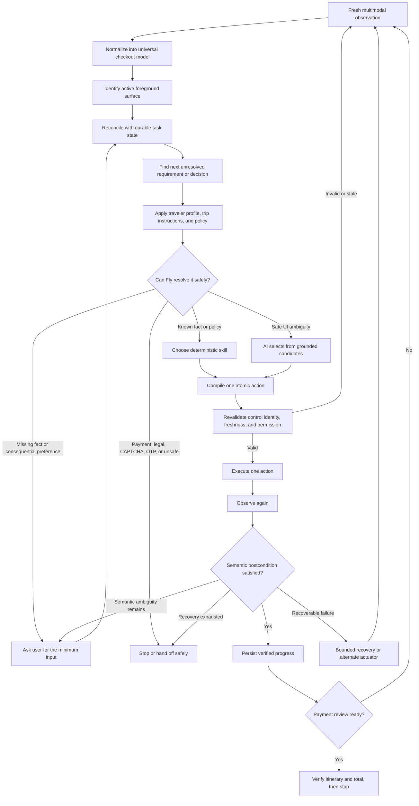

# Fly — Final Product and Engineering Roadmap

## North star

Fly should complete checkout across different airline and OTA websites by dynamically understanding each page, using the selected traveler’s facts, preferences, constraints, and trip-specific instructions, handling unexpected situations safely, and stopping only when payment or explicit user authorization is required.

The Chrome extension is the first actuator and proving ground. The long-term product is one reusable checkout-intelligence engine shared by the browser extension, a secure background runtime, and an iOS experience.

Current release boundary:

```text
Selected flight
→ complete traveler and contact details
→ resolve fares, bags, seats, insurance, and other required choices
→ verify itinerary and price
→ reach payment review
→ stop before payment, legal acceptance, or purchase
```

“Handle every surprise” does not mean silently completing every situation. It means Fly always responds correctly: recover when safe, ask for the smallest missing decision, or stop clearly at a safety boundary.

## End-to-end system flow



## Core components

- **Universal checkout model** — Represents stages, passengers, fields, decisions, prices, selections, blockers, foreground surfaces, payment readiness, and terminal status independently of airline wording or markup.

- **Stable logical control identity** — Gives every logical control a unique identity, meaning, state, surface owner, available actuators, and a safe way to relocate it after rerenders.

- **Multimodal perception** — Combines DOM, accessibility data, visible text, screenshots, geometry, overlays, browser events, navigation state, and specialized perception for difficult components such as canvas seat maps.

- **Foreground-surface ownership** — Makes the active modal, drawer, warning, dropdown, or confirmation authoritative over unrelated background controls.

- **Logical field adapter** — Maps physical controls to scalar and composite requirements such as names, split dates, phone components, document data, custom dropdowns, and autocomplete fields.

- **Durable task state and reconciliation** — Remembers only verified progress, approvals, decisions, prices, failures, and checkpoints, while yielding to contradictory fresh page evidence.

- **Requirement and decision engine** — Converts every unresolved item into a structured field requirement or decision with options, risk, policy status, evidence, and completion state.

- **Profile and policy engine** — Applies hard safety rules, user facts, user preferences, trip-specific instructions, product defaults, and bounded agent judgment in that order.

- **Hierarchical planner and reusable skills** — Chooses the journey objective and a reusable skill, but compiles and executes only one freshly verified atomic action at a time.

- **Bounded AI ambiguity resolver** — Uses AI only when interpretation is genuinely required and permits selection only from current grounded, actionable, policy-safe candidates.

- **Deterministic execution plane** — Executes tightly specified operations such as click, type, select, scroll, wait, and navigation after local freshness and actionability checks.

- **Semantic postcondition verification** — Verifies the intended result after every action: exact value accepted, decision resolved, modal dismissed, error cleared, price preserved, or stage advanced.

- **Recovery and loop detection** — Relocates controls, changes actuator, refreshes observation, retries a bounded strategy, returns to a verified checkpoint, detects loops, and hands off when recovery is exhausted.

- **Safety and transaction governor** — Blocks unauthorized paid extras, identity substitution, itinerary changes, price increases, legal acceptance, payment entry, final purchase, and other irreversible actions.

- **Trace, replay, and regression system** — Captures sanitized observations, decisions, actions, outcomes, and failures so every real-site problem becomes a reproducible generic regression test.

- **Lightweight site adaptation layer** — Reuses aliases, component patterns, reliable actuators, dialog signatures, and known traps without creating airline-specific end-to-end workflows.

- **Shared secure platform** — Synchronizes encrypted profiles, policies, approvals, task state, audit history, and notifications across browser, future background execution, and iOS.

## Ambiguity and surprise routing

| Situation | Required behavior |
|---|---|
| Known traveler fact | Fill deterministically and verify the accepted canonical value. |
| Missing required traveler fact | Ask the user; never invent identity information. |
| Choice resolved by explicit policy | Select deterministically and verify the decision outcome. |
| Consequential choice without applicable policy | Ask the user before changing price, itinerary, flexibility, or important trip properties. |
| Unfamiliar UI with safe grounded options | Let AI interpret the surface and select only a supplied candidate. |
| Recognized control fails to respond | Try a finite sequence of proven or bounded alternate actuators. |
| Page rerenders or changes unexpectedly | Discard stale assumptions, observe again, rebind controls, and replan. |
| Validation error appears | Convert it into an unresolved requirement and repair it before continuing. |
| Price, currency, airport, or itinerary changes | Compare with the approved state and require authorization when outside policy. |
| CAPTCHA, OTP, bank approval, login, or legal acceptance | Pause and hand off with exact instructions, then resume from fresh state. |
| Recovery budget is exhausted | Stop safely and explain the exact unresolved requirement and attempted strategies. |

## Exact build order

The order below follows technical dependencies. Each item should establish a reliable contract for the items after it. Later components may be prototyped earlier, but they should not become correctness-critical until their dependencies are complete.

| Order | Component to build                                    | What it must include                                                                                                                                                                                    | Why it comes here                                                                                                                                                | Done when                                                                                                                                  |
| ----: | ----------------------------------------------------- | ------------------------------------------------------------------------------------------------------------------------------------------------------------------------------------------------------- | ---------------------------------------------------------------------------------------------------------------------------------------------------------------- | ------------------------------------------------------------------------------------------------------------------------------------------ |
|     1 | **Universal checkout model**                          | Canonical schemas for stages, surfaces, passengers, logical fields, decisions, options, prices, blockers, approvals, payment readiness, and terminal states.                                            | Every other component needs the same vocabulary. Without it, each layer reinterprets the page differently.                                                       | Extension, backend, planner, executor, and verifier exchange the same versioned objects without dropping or redefining semantic data.      |
|     2 | **Stable logical control identity**                   | Unique logical IDs, component roles, surface ownership, state, actuator references, rerender fingerprints, and relocation rules.                                                                        | Fly must know exactly which logical control an action targets before it can execute or verify anything reliably.                                                 | Two different choices never share an identity, and the same logical control can be safely rebound after a rerender.                        |
|     3 | **Fresh multimodal observation**                      | DOM, accessibility, visible text, screenshot regions, geometry, visibility, overlap, browser events, navigation, validation, selected state, price evidence, and canvas/iframe evidence where required. | The canonical model and identities need current, independent evidence from unfamiliar pages.                                                                     | Every observation reports what is visible, actionable, selected, blocked, and foreground-owned with explicit evidence and confidence.      |
|     4 | **Foreground ownership and readiness**                | Active modal/drawer/dropdown detection, background suspension, hydration/loading classification, and foreground-first stage inference.                                                                  | Fly cannot choose the next requirement correctly if background controls override the surface the user must handle now.                                           | The Kiwi seat modal and equivalent foreground cases become `READY` and own the next action even when older controls remain behind them.    |
|     5 | **Logical field adapter**                             | Scalar fields, split dates, phone components, document fields, custom dropdowns, autocomplete, calendars, validation errors, and hierarchical completion.                                               | Raw controls must become traveler requirements before profile data can be applied safely across different markup.                                                | Known profile values compile into deterministic component-level operations without losing metadata across system boundaries.               |
|     6 | **Durable task state and reconciliation**             | Verified completions, unresolved requirements, decisions, approvals, selected/declined extras, prices, checkpoints, failures, and contradictions.                                                       | Once observation is trustworthy, Fly needs memory that preserves real progress without overruling fresh evidence.                                                | A fresh contradiction reopens the relevant requirement, while unrelated verified progress remains intact.                                  |
|     7 | **Requirement and decision engine**                   | Explicit decision IDs, types, options, required/optional status, selected outcome, risk, evidence, policy compatibility, and blockers.                                                                  | Profile policy cannot safely operate on vague page text; it needs structured unresolved decisions.                                                               | Fly can always explain what remains unresolved and why checkout may or may not continue.                                                   |
|     8 | **Profile and policy engine**                         | Hard safety rules → traveler facts/preferences → trip instructions → product defaults → bounded judgment; plus price and itinerary tolerances.                                                          | Only after decisions are explicit can Fly distinguish facts it knows, choices it may make, and choices requiring the user.                                       | Fly never invents identity or preference data, and identical policy inputs produce consistent decisions.                                   |
|     9 | **Grounded candidate builder**                        | Current candidates tied to canonical controls, exact surface, supported operation, actionability, policy result, risk, and semantic outcome.                                                            | Both deterministic logic and AI need one safe, finite action space.                                                                                              | Nothing can be selected unless it exists in the current observation and is relevant, actionable, and policy-allowed.                       |
|    10 | **Hierarchical planner and reusable skills**          | Journey objective, reusable closed-loop skills, and compilation into exactly one atomic action per turn.                                                                                                | Planning becomes useful only after the state, requirement, policy, and available actions are trustworthy.                                                        | Form, fare, baggage, seat, insurance, dialog, review, and navigation skills advance one verified action at a time.                         |
|    11 | **Bounded AI ambiguity resolver**                     | Interpretation of unfamiliar surfaces and choices using only supplied candidates, evidence, profile context, and allowed semantic outcomes.                                                             | AI should fill only the gap that deterministic contracts cannot resolve; it should not own identity, state, or execution.                                        | The model cannot invent a control, value, permission, or action outside the current candidate set.                                         |
|    12 | **Deterministic execution and freshness plane**       | Atomic commands, observation versions, control fingerprints, short action leases, target rebinding, local revalidation, and stale-action refusal.                                                       | A correct plan is unsafe if the page or target changed before execution.                                                                                         | Every action revalidates its exact assumptions immediately before execution and refuses stale, ambiguous, or unproven targets.             |
|    13 | **Semantic postcondition verifier**                   | Outcome contracts for data entry, selection, dismissal, transition, policy resolution, price preservation, and payment-review readiness.                                                                | Execution success is not task success. Fly must prove what changed before storing progress.                                                                      | No action is marked complete from an event acknowledgement alone; a fresh observation proves the intended semantic result.                 |
|    14 | **Recovery and uncertainty router**                   | Failure classification, bounded retry, relocation, alternate actuator, re-observation, checkpoint return, loop detection, user question, and precise handoff.                                           | Once actions and verification are dependable, failure can be recovered without corrupting state or guessing.                                                     | Every failure ends in verified recovery, one minimal user request, or a clear safe stop—never an infinite loop or false completion.        |
|    15 | **Safety and transaction governor**                   | Paid-extra constraints, identity protection, itinerary/airport/currency/price checks, irreversible-action boundaries, action ledger, and duplicate-attempt protection.                                  | Safety checks exist earlier through policy, but the full transaction layer needs verified state, actions, and outcomes to enforce end-to-end invariants.         | Unauthorized paid, legal, payment, purchase, identity, or itinerary actions are structurally impossible.                                   |
|    16 | **Replay and regression infrastructure**              | Sanitized DOM/accessibility/screenshot observations, decisions, candidates, actions, outcomes, failures, and production-shaped browser fixtures.                                                        | The full loop must now be improved with repeatable evidence instead of repeated manual live bookings. Initial traces should be captured throughout earlier work. | Every real-site failure becomes an offline replay, and engine changes must pass all previously accepted behaviors.                         |
|    17 | **Cross-airline coverage and lightweight adaptation** | Generic injection, control aliases, reusable UI patterns, known component actuators, dialog signatures, canvas behavior, failure signatures, and a semantic coverage matrix.                            | The universal contracts must be proven before site knowledge is allowed to optimize coverage.                                                                    | A new airline mainly adds patterns and tests, never a separate end-to-end checkout script.                                                 |
|    18 | **Secure shared platform**                            | Encrypted profile/policy storage, task-state synchronization, approvals, audit history, authentication boundaries, and notifications.                                                                   | Browser-only reliability should be proven before moving sensitive state and authority across devices and runtimes.                                               | One authoritative task can be viewed, approved, paused, and resumed securely from multiple clients.                                        |
|    19 | **Background execution runtime**                      | Isolated remote browsers, durable jobs, checkpoints, retries, resumability, secure session handoff, and CAPTCHA/OTP/login/approval pauses.                                                              | Background autonomy reuses the same proven model, planner, governor, executor contract, and verifier through a new actuator.                                     | A background task can pause and resume without duplicate actions, lost progress, or different safety behavior from the extension.          |
|    20 | **iOS product and permitted actuators**               | Profile management, live task status, approvals, interventions, deep-link resume, notifications, and platform-permitted observation/execution.                                                          | iOS should be another interface and actuator around the shared engine, not an independently implemented agent.                                                   | Users can start, monitor, approve, intervene in, and resume the same authoritative Fly task from iOS.                                      |
|    21 | **Optional authorized payment and confirmation**      | PCI-appropriate vault, narrow approval tokens, final checksums, idempotency, duplicate-booking detection, PNR/ticket/total verification, and explicit terminal states.                                  | This is a separate, higher-risk product boundary and should follow proven checkout-to-payment-review reliability.                                                | Fly never performs an irreversible action without auditable authority and never reports confirmation without independent booking evidence. |

## Component specifications

### 1. Universal checkout model

- **What it is:** The shared, versioned language used to describe every checkout independently of airline-specific wording or HTML.
- **How it works:** It normalizes observations into canonical stages, surfaces, travelers, fields, decisions, options, prices, blockers, approvals, and terminal states.
- **Goal:** Ensure every Fly subsystem has the same interpretation of the current checkout.
- **Purpose:** Prevent extension, backend, planner, executor, and verifier logic from creating contradictory versions of the same page.
- **Success criteria:** The same canonical object survives every system boundary without lost fields, changed meanings, or site-specific branches.

### 2. Stable logical control identity

- **Implementation status (2026-08-01):** Stable keys cross browser observation, backend aliases, bound actions, and post-rerender relocation. Current values and value-derived input meaning have been removed from identity; controlled-input replays and live Kiwi contact entry prove the replacement field retains its logical identity and normalized phone value. Wider rerender coverage continues under Components 16–17.
- **What it is:** A persistent semantic identity for each field, choice, and action control, separate from its temporary DOM node.
- **How it works:** It combines logical ID, component role, decision ownership, foreground surface, state, actuators, and rerender fingerprints, then safely rebinds to fresh physical elements.
- **Goal:** Always act on the intended logical control, even after dynamic page changes.
- **Purpose:** Prevent the dangerous case where Fly understands the right choice but clicks a different or stale target.
- **Success criteria:** Different options never share identities, and the same logical control can be relocated after rerenders without semantic drift.

### 3. Fresh multimodal observation

- **Implementation status (2026-08-02):** Page and foreground high-cardinality observation share one structural collection compiler. Payment structure produces `terminal-evidence/v1` as non-action evidence, while payment credentials stay excluded from executable controls. The hosted/custom acquisition gap from GoToGate `chk_msbqdht2llspb8` is repaired: native absence is unknown; visible owned credential labels and hosted-frame metadata contribute additive evidence with provenance; hidden future markup remains negative; HTTP compaction preserves the exact terminal contract. This behavior remains covered by the current **257-test unit suite** and **127-case browser matrix**; the next gate is a same-worktree Kiwi/GoToGate live canary of the new outcome journal.
- **What it is:** A current, combined view of the checkout built from all useful browser evidence.
- **How it works:** It collects DOM, accessibility, visible text, screenshot regions, geometry, overlap, browser events, navigation, validation, selections, prices, and specialized iframe/canvas evidence.
- **Goal:** Describe what actually exists and is actionable now on an unfamiliar page.
- **Purpose:** Avoid trusting a single weak source such as HTML structure or screenshot interpretation alone.
- **Success criteria:** Each observation accurately reports visible controls, current values, selected options, blockers, prices, foreground ownership, and supported operations with evidence.

### 4. Foreground ownership and readiness

- **Implementation status (2026-08-02):** Foreground readiness, bounded seat capture, and terminal destination readiness share authoritative evidence. The producer now recognizes an opaque hosted payment widget from visible owned structure, while route-only shells and hidden future widgets remain transient. The 20-second deadline and readiness consumer are unchanged. Fresh GoToGate live proof remains the promotion gate.
- **What it is:** The contract that decides which active page surface currently owns interaction and whether it is ready for action.
- **How it works:** It detects modals, drawers, dialogs, dropdowns, overlays, loading states, and hydration, then temporarily suspends unrelated background controls.
- **Goal:** Make Fly handle the surface directly in front of the user before reasoning about the page behind it.
- **Purpose:** Prevent background fields or an unchanged URL from incorrectly blocking an actionable foreground decision.
- **Success criteria:** Foreground surfaces such as the Kiwi seat modal become ready and own the next action even when older traveler controls remain visible behind them.

### 5. Logical field adapter

- **Implementation status (2026-08-03):** Scalar phone values work, but fresh GoToGate traces exposed the second valid state of its custom country-code combobox. When `+386` leaves an exact `Slovenia (+386)` dropdown open, the active option is not retained as the continuation actuator of the same logical field and global readiness stops prematurely. Direct commit still passes. The universal remaining work is one query → exact option → settled-value episode with bounded readiness, not a site selector.
- **What it is:** The bridge from physical website controls to canonical traveler and contact requirements.
- **How it works:** It groups scalar and composite controls, assigns component roles, maps profile values to exact operations, and verifies completion hierarchically.
- **Goal:** Fill the same traveler fact correctly across different field layouts and widget implementations.
- **Purpose:** Handle split dates, phone prefixes, document components, custom dropdowns, calendars, autocomplete, and validation without per-site workflows.
- **Success criteria:** Known profile values compile into correct component-level operations and retain all semantic metadata through observation, planning, execution, and verification.

### 6. Durable task state and reconciliation

- **Implementation status (2026-08-03):** The canonical receipt-ownership repair is now live-proven on GoToGate trace `chk_msdar6yu7k7bor`. Durable verified-action receipts are the sole authority for expected coverage; journal and ledger only prove reconciliation. Ordinary page siblings kept eight distinct expected owners, all eight expected action IDs reconciled, and terminal review completed with no missing IDs or irreversible action. The automated baseline remains **266/266 unit tests**, **127/127 browser replays**, and `npm run check`. A minor audit-normalization follow-up remains: Flexible Ticket parent/confirmation representations should compact into one user-facing aggregate without changing receipt expectations.

- **Discovering live evidence (2026-08-03):** GoToGate trace `chk_msda69f4zpfr21` proved the immutable boundary and terminal unification live: 8/8 exact verified actions entered the obligation register and final review no longer lacked `payment_review`. It also exposed the now-repaired Roadmap #6 identity leak: stale episode lineage collapsed ordinary sibling receipts and direct/journal identities competed with receipt expectations.

- **Implementation status (2026-08-03):** Post-restart GoToGate trace `chk_msd5r8w2cvtlc2` proves journal/ledger code is live but incomplete: one Flexible Ticket outcome was durably represented while nine commerce actions were browser-verified. Coverage declared `1/1` complete because its expected set is populated from successful admission, making admission failure invisible. The remaining universal work is an independent, idempotent verified-action obligation stream reconciled to journal and ledger before terminal completion.
- **What it is:** Fly’s authoritative memory of verified progress across the full checkout.
- **How it works:** It stores completed requirements, decisions, approvals, extras, prices, failures, and checkpoints, then reconciles them against every fresh observation.
- **Goal:** Preserve real progress while immediately recognizing when the page contradicts previous state.
- **Purpose:** Avoid both forgetting completed work and continuing from stale assumptions.
- **Success criteria:** Contradictions reopen only affected requirements, verified unrelated progress survives, and state never overrides stronger fresh evidence.

### 7. Requirement and decision engine

- **Implementation status (2026-08-03):** The explicit-versus-fallback provenance defect from `chk_mscz1j3loqi2sj` is repaired. Explicit action lineage is stored separately from fallback recovery context; only explicit identity or exact actuator equality may continue an episode. The retained-open Flexible Ticket parent, sibling decisions, and exact commerce journal identity are replay-proven. Fresh GoToGate/Kiwi live recertification remains.
- **What it is:** A structured inventory of everything that must be filled, chosen, declined, approved, or resolved before checkout can advance.
- **How it works:** It creates explicit IDs, types, options, required status, risk, evidence, policy compatibility, blockers, selected outcomes, and lifecycle states.
- **Goal:** Make the exact next unresolved checkout obligation explicit.
- **Purpose:** Prevent vague or contradictory states such as an extra being simultaneously declined and still pending.
- **Success criteria:** Fly can always state what remains unresolved, what evidence supports it, and why continuing is allowed or blocked.

### 8. Profile and policy engine

- **What it is:** The decision authority that translates user data and preferences into safe checkout choices.
- **How it works:** It applies hard safety rules, traveler facts and preferences, trip instructions, product defaults, and bounded judgment in a fixed priority order.
- **Goal:** Make checkout decisions correctly for the selected user rather than from generic assumptions.
- **Purpose:** Resolve fares, baggage, seats, insurance, flexibility, and price tolerance without inventing preferences.
- **Success criteria:** Known choices resolve consistently; missing facts and consequential uncovered choices result in targeted user questions rather than guesses.

### 9. Grounded candidate builder

- **Implementation status (2026-08-03):** Candidate admission now gives an exact goal-owned correction priority over contextual navigation, admits a newly hydrated exact safe foreground `Next`/`Continue`, and removes handoff/wait whenever a grounded action exists. Paid siblings remain diagnostic context but cannot enter the selectable set without typed authorization. Same-label dismiss and submit controls retain distinct compiled effects.
- **What it is:** The finite list of actions Fly is currently allowed to consider.
- **How it works:** It binds the current requirement to observed controls, supported operations, exact surface ownership, actionability, risk, policy outcome, and expected semantic result.
- **Goal:** Give deterministic logic and AI a small, safe, current action space.
- **Purpose:** Prevent invented selectors, irrelevant controls, stale targets, and policy-conflicting actions from reaching selection.
- **Success criteria:** Every selectable candidate exists in the fresh observation, is relevant to the current requirement, is actionable, and passes policy.

### 10. Hierarchical planner and reusable skills

- **Implementation status (2026-08-02):** Planning is correctly suppressed by a terminal latch on later turns, but fresh same-turn arbitration is ordered incorrectly. The terminal outcome currently returns after site-failure and profile-readiness branches. Move the verified terminal return immediately after TaskState reduction; profile, decision, recovery, and model planning must be unreachable once the task outcome is complete.
- **What it is:** The planning layer that connects the checkout objective to reusable capabilities and atomic actions.
- **How it works:** It chooses a journey objective, invokes a reusable closed-loop skill, and compiles only the next single action before observing again.
- **Goal:** Reuse reliable behavior without asking AI to reason from scratch for every keystroke.
- **Purpose:** Make form, fare, baggage, seat, insurance, dialog, review, and navigation behavior faster and more consistent while remaining closed-loop.
- **Success criteria:** Skills never run open-loop; every step uses a fresh observation, one action, and semantic verification before continuing.

### 11. Bounded AI ambiguity resolver

- **What it is:** The interpretation layer for genuinely unfamiliar or semantically ambiguous checkout surfaces.
- **How it works:** It receives page evidence, current requirement, user context, allowed outcomes, and a finite grounded candidate set, then selects one candidate or requests authority.
- **Goal:** Generalize to new airline interfaces without giving the model unrestricted browser control.
- **Purpose:** Use AI where flexible interpretation adds value while deterministic systems retain identity, permission, execution, and state authority.
- **Success criteria:** AI never invents a control, value, profile fact, permission, or action outside the supplied candidate contract.

### 12. Deterministic execution and freshness plane

- **Implementation status (2026-08-03):** Candidate construction, governance, and browser dispatch share fresh canonical ownership. A completed choice may cross the foreground boundary only through its exact owning opener; a newly hydrated safe foreground `Next` remains actionable; same-label dismiss and checkout-submit controls preserve their distinct typed effects. Stale proof, competing openers, background controls, mismatched operations, and unapproved paid effects remain denied.
- **What it is:** The narrow runtime that turns one approved atomic command into a browser interaction.
- **How it works:** It validates observation version, identity, fingerprint, surface, visibility, actionability, policy, and action lease immediately before dispatching click, type, select, scroll, wait, or navigation.
- **Goal:** Execute the intended current action and refuse anything stale or ambiguous.
- **Purpose:** Separate probabilistic planning from tightly controlled physical browser mutation.
- **Success criteria:** No stale, hidden, covered, mismatched, unproven, or unauthorized target is executed.

### 13. Semantic postcondition verifier

- **Implementation status (2026-08-03):** Live semantic verification is correct—`chk_msd0topc299a64` emitted exact `EXACT_FREE_OPTION_VERIFIED`, surface-advance, stage-advance, and payment evidence through the real GoToGate payment transition. The current compact-result contract now carries ownership from the exact resolved target snapshot into durable admission; the new regression proves this without relying on stale planning metadata. Fresh live proof requires the backend restart.
- **What it is:** The outcome checker that determines whether an action accomplished its intended task result.
- **How it works:** It compares fresh before-and-after evidence against explicit contracts for data entry, selection, dismissal, transition, policy resolution, price preservation, and readiness.
- **Goal:** Store progress only after the browser proves the desired semantic outcome.
- **Purpose:** Distinguish “an event was sent” from “the field was accepted,” “the modal closed,” or “the checkout advanced.”
- **Success criteria:** No mutation is marked complete from an acknowledgement alone, and every completion has fresh supporting evidence.

### 14. Recovery and uncertainty router

- **Implementation status (2026-08-03):** Fallback episode context can no longer prove its own ownership. Exact selected-control/postcondition evidence survives browser transports that omit planning lineage, while stale sibling episodes retire. The retained-open parent, repeated-seat, dirty-sibling, and foreground-navigation replays pass without generic ambiguity or false handoff.
- **What it is:** The controlled response system for failures, surprises, and remaining ambiguity.
- **How it works:** It classifies the failure, then chooses bounded retry, relocation, alternate actuator, re-observation, checkpoint return, user question, or safe handoff while detecting loops.
- **Goal:** Recover from normal website instability without guessing or corrupting checkout state.
- **Purpose:** Make “works across airlines” mean failures are detected, contained, and handled correctly rather than assumed not to occur.
- **Success criteria:** Every failure ends in verified recovery, one minimal user request, or a precise safe stop; there are no infinite loops or false completions.

### 15. Safety and transaction governor

- **Implementation status (2026-08-03):** The paid-effect invariant is enforced independently of price parsing: `select_paid_option` requires the exact profile-resolver authorization in shared policy and again in the governor before dispatch. Compact and bidi prefix currency such as `EUR37.95` now parses canonically, but parser failure can no longer grant paid authority.
- **What it is:** The final authority that enforces user permission and irreversible-action boundaries across the whole transaction.
- **How it works:** It checks paid extras, identity integrity, itinerary, airport, currency, price, legal acceptance, payment, purchase, action history, and duplicate-attempt risk before allowing actions.
- **Goal:** Make dangerous or unauthorized outcomes structurally impossible.
- **Purpose:** Protect the user from incorrect charges, changed travel, duplicate bookings, identity errors, and unapproved commitments.
- **Success criteria:** Unauthorized paid, identity, itinerary, legal, payment, and purchase actions cannot reach execution, even if another layer proposes them.

### 16. Replay and regression infrastructure

- **Implementation status (2026-08-03):** The current baseline is **266/266 agent unit tests**, **127/127 browser replays**, and a green production build/type/syntax check. Coverage includes receipt-only expectation authority, stale-page sibling isolation, exact foreground-child aggregation, explicit/fallback lineage separation, retained-open Flexible Ticket completion, exact foreground `Next`, paid-effect denial without authorization, compact/bidi currency, both seat legs, and terminal review safety. Fresh GoToGate and Kiwi live recertification are the remaining promotion gates.
- **What it is:** A reproducible test system built from sanitized real checkout behavior.
- **How it works:** It captures DOM, accessibility, screenshots, canonical observations, state, decisions, candidates, actions, postconditions, and failures, then replays them offline and in browser fixtures.
- **Goal:** Turn every production failure into permanent, repeatable coverage.
- **Purpose:** Improve reliability without repeatedly depending on slow, costly, and unstable live booking sessions.
- **Success criteria:** Every material real-site failure has a regression, and all previously accepted behaviors must pass before engine changes ship.

### 17. Cross-airline coverage and lightweight adaptation

- **Implementation status (2026-08-03):** Kiwi and GoToGate are accepted on the same current engine. GoToGate `chk_msdar6yu7k7bor` reconciled 8/8 expected receipts and Kiwi canary `chk_msdaz8oiuvr170` reconciled 5/5; both reached verified payment review with zero missing IDs and zero irreversible actions. The active milestone is now a controlled structural expansion: one direct airline, followed by one structurally different OTA. Use the same baseline traveler/no-paid-extras policy first to isolate site-structure gaps; after those paths are stable, expand a bounded policy matrix for paid seat, baggage, flexibility/check-in, and other explicitly authorized preferences.
- **What it is:** Reusable knowledge that improves the universal engine on common and difficult airline UI patterns.
- **How it works:** It stores aliases, component patterns, proven actuators, dialog signatures, canvas behavior, known traps, successful trajectories, and failure signatures without owning full workflows.
- **Goal:** Expand coverage efficiently across direct airlines and structurally different OTAs.
- **Purpose:** Reuse proven site knowledge without turning every airline into a separate automation project.
- **Success criteria:** A new airline primarily adds patterns and regression cases, while universal contracts remain the correctness authority.

### 18. Secure shared platform

- **What it is:** The cross-device backend for sensitive profile data, policy, approvals, task state, notifications, and audit history.
- **How it works:** It encrypts stored and transmitted data, enforces authentication and authorization, synchronizes authoritative state, and exposes narrowly scoped approval and notification interfaces.
- **Goal:** Let browser, background runtime, and iOS safely participate in the same task.
- **Purpose:** Avoid fragmented user data, duplicated state, inconsistent permissions, and insecure credential handling across clients.
- **Success criteria:** One authoritative task can be securely viewed, approved, paused, resumed, and audited from multiple clients without leaking sensitive data.

### 19. Background execution runtime

- **What it is:** A secure remote-browser actuator capable of continuing Fly tasks without the user keeping an active checkout tab open.
- **How it works:** It runs isolated browser sessions as durable jobs with checkpoints, retries, resumability, session handoff, notifications, and pauses for CAPTCHA, OTP, login, or approval.
- **Goal:** Allow safe asynchronous checkout progress using the same intelligence as the extension.
- **Purpose:** Move from user-attended browser assistance toward dependable background task execution.
- **Success criteria:** Tasks pause and resume without duplicate actions or lost progress, and background execution obeys exactly the same policy and verification contracts as the extension.

### 20. iOS product and permitted actuators

- **What it is:** The mobile interface—and where platform permissions permit, an actuator—for the shared Fly system.
- **How it works:** It manages profiles, shows progress, receives notifications, collects approvals and interventions, resumes tasks through deep links, and sends authorized input to the shared task.
- **Goal:** Let users start, monitor, approve, intervene in, and resume Fly work from iPhone.
- **Purpose:** Make Fly available beyond the desktop without rebuilding the checkout intelligence as a separate iOS agent.
- **Success criteria:** iOS operates on the same authoritative task, policy, evidence, and approval history as browser and background clients.

### 21. Optional authorized payment and confirmation

- **What it is:** A future high-risk extension from verified payment review to authorized purchase and independently verified ticket confirmation.
- **How it works:** It uses a PCI-appropriate vault, narrow approval tokens, final passenger/itinerary/currency/price checksums, idempotency, duplicate protection, and confirmation evidence such as PNR or ticket number.
- **Goal:** Complete a purchase safely only when the product explicitly adopts this responsibility and the user provides auditable authority.
- **Purpose:** Prevent duplicate charges, unauthorized purchases, incorrect totals, and false claims that a payment or booking succeeded.
- **Success criteria:** No irreversible action occurs without explicit authority, and Fly reports `CONFIRMED` only from independent booking evidence rather than a click or payment acknowledgement.

### Immediate implementation sequence

The next work in the current repository is therefore:

1. ✅ Add the exact GoToGate dropdown → confirmation → completed-parent replay and the live written-currency bundle-price replay.
2. ✅ Implement one parent decision episode with child-surface completion propagation, selected-outcome suppression, an exact completed-surface exit, and semantic cycle detection.
3. ✅ Extend that episode across repeated seat segments and final confirmation, and make its terminal result the only transaction-fact authority.
4. ✅ Re-run all accepted checkout regressions; **251 unit tests**, **123 browser replays**, and repository checks pass.
5. ✅ Prove the repaired decision lifecycle live through both GoToGate seat legs, final confirmation, later extras, and arrival at `/rf/payment`.
6. ✅ Compile one non-action terminal evidence contract and consume it unchanged in perception, readiness, TaskState, and transaction review.
7. ✅ Reconcile GoToGate's owned itinerary, traveler, total, bags, and verified decision outcomes at the physical payment page.
8. ✅ Return a freshly completed terminal TaskState before profile/readiness/planner arbitration, and make that outcome monotonic for the rest of the turn.
9. ✅ Restrict profile logical fields to field-compatible controls; broad nearby or accessibility text may classify evidence but cannot grant field ownership to activation-only buttons.
10. ✅ **Complete authoritative decision lineage; keep the atomic verified-action outcome committer.** Explicit current-action identity and fallback recovery context are separate; exact actuator evidence bridges stripped transport; ordinary verified choices and true multi-surface aggregates reconcile under one owner.
11. ✅ **Add journal coverage reconciliation.** Every verified consequential decision must be represented exactly once; navigation-only and profile-field actions never become commerce outcomes.
12. ✅ Add exact unit/browser proofs for same-label sibling extras, Flexible Ticket parent/child inheritance, multi-leg random seating, and payment terminal coverage.
13. ✅ Convert the fresh GoToGate regression into exact retained-parent, compact/bidi paid-price, foreground-navigation, and canonical outcome-coverage replays.
14. ✅ Separate explicit lineage from fallback context, restore the exact satisfied parent on child-surface return, reject every unapproved paid physical effect before dispatch, and canonicalize journal/ledger owner identity.
15. 🟡 Live traces `chk_msd0topc299a64` and `chk_msd4hy91ah117b` passed GoToGate traversal and safety but were processed by a stale/different reducer path: their saved verified result journals correctly against current source while the live TaskState remains empty.
16. ✅ Resolve compact verified results through the exact resolved target snapshot; add a live-shaped no-planned-group regression; preserve parent/child and seat aggregation.
17. ⏳ Make loaded build/reducer identity observable, restart the backend, re-run GoToGate and Kiwi, and require non-empty journal/ledger coverage whenever the session contains verified consequential actions.
18. Then test one direct airline and one structurally different OTA.
19. Keep `payment_review_reached` as the current terminal product boundary and preserve the structural prohibition on payment, billing, legal, card, and purchase mutation.

### Current execution checklist

- [x] Return a freshly latched `payment_review_reached` before every lower-priority same-turn profile or planning branch.
- [x] Publish no payment, billing, legal, newsletter, Edit, or generic candidate after the terminal latch.
- [x] Remove mutable values from stable logical identity and verify phone rerender continuity.
- [x] Reject unowned generic route pairs and certify the owned Kiwi itinerary.
- [x] Fix foreground ownership and readiness with the Kiwi seat-modal replay.
- [x] Reconcile verified task state and expose the exact next unresolved requirement.
- [x] Apply profile policy and produce only grounded, safe candidates.
- [x] Execute fresh atomic actions and verify their semantic postconditions.
- [x] Pass Kiwi checkout-to-payment-review acceptance.
- [x] Reject route-shaped passenger/age copy without losing legitimate untagged itinerary routes.
- [x] Reconcile a parent dropdown and child confirmation into one durable decision episode without repeating the selected option.
- [x] Carry one seat decision through repeated legs and final confirmation, committing only its verified terminal outcome.
- [x] Prevent provisional background UI state from independently entering transaction facts.
- [x] Compile live written-currency bundle prices from option-owned accessibility evidence without treating benefit copy as free.
- [x] Reach GoToGate's physical payment form without a paid-seat regression.
- [x] Unify non-action terminal evidence across browser classification, readiness, TaskState, and transaction review.
- [x] Reconcile the GoToGate review route, traveler, total, bags, and terminal decision outcomes at the physical payment page.
- [x] Exclude activation-only payment/navigation buttons from profile logical fields while preserving real pending-contact inputs.
- [x] Prove same-turn terminal dominance on GoToGate and retain the accepted Kiwi canary.
- [x] Commit every verified consequential action directly into the durable outcome journal under one canonical decision instance.
- [x] Prove journal coverage: distinct siblings once each, parent/child once total, repeated seat legs as one outcome with segment evidence, and no navigation/profile leakage.
- [ ] Separate explicit action lineage from fallback recovery identity; fallback state must never prove that it owns the current action.
- [ ] On child-surface return, prefer the fresh exact profile-compatible selected parent and expose only its proven surface-exit actuator.
- [ ] Reject `select_paid_option` without explicit paid authorization before model selection and again before browser dispatch, even when price parsing is absent.
- [ ] Normalize bidi/prefix/suffix currency presentation and add the exact retained-open GoToGate replay without weakening the authorization invariant.
- [ ] Live-prove journal and transaction-ledger coverage on GoToGate while retaining the Kiwi canary.
- [ ] Prove the same terminal contract on a structurally different checkout.
- [ ] Pass clean and dirty GoToGate regressions.
- [ ] Pass one direct airline and one structurally different OTA.
- [ ] Convert every new failure into a replay test and rerun the full suite.

## Success metrics

- Percentage of eligible checkouts reaching verified payment review without intervention.
- Percentage completed after safe autonomous recovery.
- User handoffs per checkout and whether each handoff was necessary and actionable.
- Incorrect field, extra, fare, seat, itinerary, price, and completion decisions.
- Unsafe or unauthorized actions, with a target of zero.
- False completion reports, with a target of zero.
- Median actions, model calls, latency, and cost per completed checkout.
- Fresh-site success across component patterns not present in the training and replay corpus.
- Regression pass rate across all previously supported sites and difficult components.

## Architectural rules

1. Fresh combined page evidence is authoritative; durable state is verified memory.
2. Every logical control has one stable identity and explicit surface ownership.
3. AI interprets ambiguity but never invents controls, profile facts, or permission.
4. The executor accepts only grounded, current, policy-safe atomic actions.
5. Every state-changing action requires a semantic postcondition from a fresh observation.
6. Recovery is bounded, recorded, and scoped to the exact requirement or control.
7. A failed requirement does not erase verified progress or block unrelated executable work.
8. Consequential ambiguity goes to the user; mechanical ambiguity goes to bounded recovery or grounded AI.
9. Site knowledge may improve performance but may not override the universal contracts.
10. Browser, background, and iOS runtimes share one checkout model, policy system, task state, and verification logic.

## Final architecture statement

```text
Universal checkout intelligence
+ browser extension actuator
+ future secure background-browser actuator
+ future iOS interface and permitted actuators
+ shared encrypted profile, policy, approval, and task-state platform
```

The durable competitive advantage is not an AI that clicks more intelligently. It is a universal checkout execution system in which AI handles genuine ambiguity while deterministic contracts control identity, state, execution, verification, recovery, and safety.
