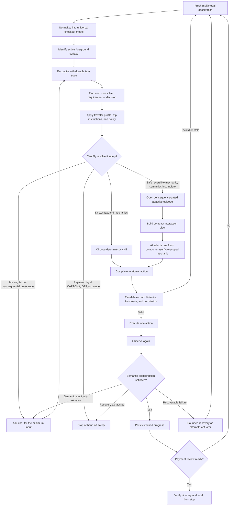

# Fly — Final Product and Engineering Roadmap

Product direction, scope boundaries, and promotion criteria are defined in `FLY_VISION_PRD.md`. This roadmap defines the target architecture and engineering dependency order. Use `FLY_COVERAGE_MATRIX.md` for current acceptance truth and `FLY_PROGRESS.md` for chronological evidence.

## North star

Fly should complete checkout across different airline and OTA websites by dynamically understanding each page, using the selected traveler’s facts, preferences, constraints, and trip-specific instructions, handling unexpected situations safely, and stopping only when payment or explicit user authorization is required.

The Chrome extension is the first actuator and proving ground. The long-term product is one reusable checkout-intelligence engine shared by the browser extension, a secure background runtime, and an iOS experience.

### Current architectural concern and correction (2026-08-06)

Fly must not become so formal at the mechanical browser layer that it suppresses the model's ability to solve a harmless unfamiliar widget. EasyJet trace `chk_msez60hyieyxll` understood the exact objective `title=mr` and observed a unique visible, hit-tested trigger, yet stopped because the hidden state node and visible actuator were not one proven `open` capability. The chosen actuator was then rebound to a different zero-size member and viewport recovery evaluated the logical state owner instead of the selected actuator. This is an infrastructure boundary failure, not missing profile reasoning and not evidence that a site-specific EasyJet workflow is required.

The correction is a **Consequence-Gated Adaptive Operator**: retain canonical semantic planning as the deterministic fast path, but do not require a fully compiled decision before every harmless click. When checkout is unfinished and the current surface contains an exact, enabled, low-consequence reversible control, Fly may try one bounded mechanic through the same governor and verifier. Constrain consequences rather than requiring perfect DOM interpretation before every harmless action. Paid, legal, payment, purchase, identity, itinerary, price, stale-target, and completion authority remain deterministic and independently enforced.

EasyJet trace `chk_mshf1di35xcw1t` exposed the broader form of the problem after traveler fields and Continue had already worked: a persistent positioned price/seat summary containing action text was falsely promoted to exclusive foreground, while the real page-owned safe seat actuator never became a formal decision goal. The universal correction is structural foreground ownership plus a bounded no-goal fallback—not another EasyJet seat rule.

Fly therefore maintains two views of the same fresh browser state: a compact **agent interaction view** containing the objective, relevant controls/regions, recent changes, allowed mechanics, forbidden effects, failed hypotheses, and canonical success condition; and a richer private **authority view** containing provenance, ownership, policy, transaction facts, action receipts, freshness, and completion evidence. The model may propose a short mechanical sequence, but the runtime leases, executes, reobserves, and verifies only one atomic action at a time.

Current release boundary:

```text
Selected flight
→ complete traveler and contact details
→ resolve fares, bags, seats, insurance, and other required choices
→ verify itinerary and price
→ reach payment review
→ stop before payment, legal acceptance, or purchase
```

“Handle every surprise” does not mean silently completing every situation. It means Fly always responds correctly: recover when safe, ask for the smallest missing decision, or stop clearly at a safety boundary.

## End-to-end system flow



## Core components

- **Universal checkout model** — Represents stages, passengers, fields, decisions, prices, selections, blockers, foreground surfaces, payment readiness, and terminal status independently of airline wording or markup.

- **Stable logical control identity** — Gives every logical control a unique identity, meaning, state, surface owner, available actuators, and a safe way to relocate it after rerenders.

- **Multimodal perception** — Combines DOM, accessibility data, visible text, screenshots, geometry, overlays, browser events, navigation state, and specialized perception for difficult components such as canvas seat maps.

- **Compact agent interaction view** — Projects the authoritative observation into a small page-wide or objective-local representation containing stable interactive IDs, visible state, recent diffs, allowed reversible mechanics, forbidden effects, failed attempts, and canonical success. The private authority graph remains available to the governor and verifier rather than being copied wholesale into model context.

- **Foreground-surface ownership** — Makes the active modal, drawer, warning, dropdown, or confirmation authoritative over unrelated background controls.

- **Logical field adapter** — Maps physical controls to scalar and composite requirements such as names, split dates, phone components, document data, custom dropdowns, and autocomplete fields.

- **Durable task state and reconciliation** — Remembers only verified progress, approvals, decisions, prices, failures, and checkpoints, while yielding to contradictory fresh page evidence.

- **Requirement and decision engine** — Converts every unresolved item into a structured field requirement or decision with options, risk, policy status, evidence, and completion state.

- **Profile and policy engine** — Applies hard safety rules, user facts, user preferences, trip-specific instructions, product defaults, and bounded agent judgment in that order.

- **Hierarchical planner and reusable skills** — Chooses the journey objective and a reusable skill, but compiles and executes only one freshly verified atomic action at a time.

- **Consequence-gated adaptive interaction operator** — Preserves canonical semantics as the fast path, but when formal planning has no goal and checkout is unfinished, may choose one exact current low-consequence reversible mechanic inside a durable attempt/effect budget. The private governor retains consequence and completion authority.

- **Deterministic execution plane** — Executes tightly specified operations such as click, type, select, scroll, wait, and navigation after local freshness and actionability checks.

- **Semantic postcondition verification** — Verifies the intended result after every action: exact value accepted, decision resolved, modal dismissed, error cleared, price preserved, or stage advanced.

- **Recovery and loop detection** — Relocates controls, changes actuator, refreshes observation, retries a bounded strategy, returns to a verified checkpoint, detects loops, and hands off when recovery is exhausted.

- **Safety and transaction governor** — Blocks unauthorized paid extras, identity substitution, itinerary changes, price increases, legal acceptance, payment entry, final purchase, and other irreversible actions.

- **Trace, replay, and regression system** — Captures sanitized observations, decisions, actions, outcomes, and failures so every real-site problem becomes a reproducible generic regression test.

- **Lightweight site adaptation layer** — Reuses aliases, component patterns, reliable actuators, dialog signatures, and known traps without creating airline-specific end-to-end workflows.

- **Shared secure platform** — Synchronizes encrypted profiles, policies, approvals, task state, audit history, and notifications across browser, future background execution, and iOS.

## Ambiguity and surprise routing

| Situation | Required behavior |
|---|---|
| Known traveler fact | Fill deterministically and verify the accepted canonical value. |
| Missing required traveler fact | Ask the user; never invent identity information. |
| Choice resolved by explicit policy | Select deterministically and verify the decision outcome. |
| Consequential choice without applicable policy | Ask the user before changing price, itinerary, flexibility, or important trip properties. |
| Known objective on an unfamiliar reversible widget | Preserve the objective and local component/surface, build the compact interaction view, and let AI test one current visible reversible mechanic inside the allowed-effect and attempt budget. Exact semantic completion still requires fresh canonical verification. |
| Formal goal missing but one exact current low-consequence control exists | Publish one bounded adaptive interaction; execute only after the consequence governor accepts it; reobserve and verify the state change. |
| Unfamiliar UI with no exact safe actuator or only consequential/unknown commercial actions | Reobserve or stop precisely; do not grant whole-page exploratory authority. |
| Recognized control fails to respond | Try a finite sequence of proven or bounded alternate actuators. |
| Page rerenders or changes unexpectedly | Discard stale assumptions, observe again, rebind controls, and replan. |
| Validation error appears | Convert it into an unresolved requirement and repair it before continuing. |
| Price, currency, airport, or itinerary changes | Compare with the approved state and require authorization when outside policy. |
| CAPTCHA, OTP, bank approval, login, or legal acceptance | Pause and hand off with exact instructions, then resume from fresh state. |
| Recovery budget is exhausted | Stop safely and explain the exact unresolved requirement and attempted strategies. |

## Exact build order

The order below follows technical dependencies. Each item should establish a reliable contract for the items after it. Later components may be prototyped earlier, but they should not become correctness-critical until their dependencies are complete.

| Order | Component to build                                    | What it must include                                                                                                                                                                                    | Why it comes here                                                                                                                                                | Done when                                                                                                                                  |
| ----: | ----------------------------------------------------- | ------------------------------------------------------------------------------------------------------------------------------------------------------------------------------------------------------- | ---------------------------------------------------------------------------------------------------------------------------------------------------------------- | ------------------------------------------------------------------------------------------------------------------------------------------ |
|     1 | **Universal checkout model**                          | Canonical schemas for stages, surfaces, passengers, logical fields, decisions, options, prices, blockers, approvals, payment readiness, and terminal states.                                            | Every other component needs the same vocabulary. Without it, each layer reinterprets the page differently.                                                       | Extension, backend, planner, executor, and verifier exchange the same versioned objects without dropping or redefining semantic data.      |
|     2 | **Stable logical control identity**                   | Unique logical IDs, component roles, surface ownership, state, actuator references, rerender fingerprints, and relocation rules.                                                                        | Fly must know exactly which logical control an action targets before it can execute or verify anything reliably.                                                 | Two different choices never share an identity, and the same logical control can be safely rebound after a rerender.                        |
|     3 | **Fresh multimodal observation + compact interaction view** | Rich DOM/accessibility/visual evidence for private authority, plus a bounded model-facing projection of objective, stable interactive IDs, visible state, local geometry, recent diffs, allowed mechanics, forbidden effects, failures, and success condition. | The governor needs complete evidence, while the model needs a small coherent environment it can reason over quickly. Sending the entire authority graph harms latency and can hide obvious mechanics. | The private observation preserves full provenance; the model packet remains bounded, covers every currently relevant visible mechanic, and never drops the exact target or recent causal feedback. |
|     4 | **Foreground ownership and readiness**                | Active modal/drawer/dropdown detection, background suspension, hydration/loading classification, and foreground-first stage inference.                                                                  | Fly cannot choose the next requirement correctly if background controls override the surface the user must handle now.                                           | The Kiwi seat modal and equivalent foreground cases become `READY` and own the next action even when older controls remain behind them.    |
|     5 | **Logical field adapter**                             | Scalar fields, split dates, phone components, document fields, custom dropdowns, autocomplete, calendars, validation errors, and hierarchical completion.                                               | Raw controls must become traveler requirements before profile data can be applied safely across different markup.                                                | Known profile values compile into deterministic component-level operations without losing metadata across system boundaries.               |
|     6 | **Durable task state and reconciliation**             | Verified completions, unresolved requirements, decisions, approvals, selected/declined extras, prices, checkpoints, failures, and contradictions.                                                       | Once observation is trustworthy, Fly needs memory that preserves real progress without overruling fresh evidence.                                                | A fresh contradiction reopens the relevant requirement, while unrelated verified progress remains intact.                                  |
|     7 | **Requirement and decision engine**                   | Explicit decision IDs, types, options, required/optional status, selected outcome, risk, evidence, policy compatibility, and blockers.                                                                  | Profile policy cannot safely operate on vague page text; it needs structured unresolved decisions.                                                               | Fly can always explain what remains unresolved and why checkout may or may not continue.                                                   |
|     8 | **Profile and policy engine**                         | Hard safety rules → traveler facts/preferences → trip instructions → product defaults → bounded judgment; plus price and itinerary tolerances.                                                          | Only after decisions are explicit can Fly distinguish facts it knows, choices it may make, and choices requiring the user.                                       | Fly never invents identity or preference data, and identical policy inputs produce consistent decisions.                                   |
|     9 | **Grounded candidate and capability builder**         | Deterministic goal-owned candidates plus fresh component/surface mechanical hypotheses, each tied to an exact visible control/region, actionability, policy result, risk, expected effect, and causal success test. | The deterministic fast path needs exact semantic candidates; bounded adaptation must still see a unique safe actuator when its framework-specific `open` operation cannot yet be proven. | Deterministic actions remain exact and goal-owned; adaptive hypotheses are freshly grounded, reversible, locally owned, policy-allowed, and independently verifiable without global sibling trust. |
|    10 | **Hierarchical planner and reusable skills**          | Journey objective, reusable closed-loop skills, and compilation into exactly one atomic action per turn.                                                                                                | Planning becomes useful only after the state, requirement, policy, and available actions are trustworthy.                                                        | Form, fare, baggage, seat, insurance, dialog, review, and navigation skills advance one verified action at a time.                         |
|    11 | **Consequence-gated adaptive interaction operator**    | Canonical fast path, compact current-surface view, exact actuator set, allowed operations, forbidden effects, attempt/deadline budget, failed-strategy memory, one-action reobservation, and observable/canonical completion checks. | Ordinary reversible browser mechanics must not require perfect semantic compilation, while the supervisor still retains facts, permission, transaction state, and completion authority. | A missing formal goal no longer stops checkout when an exact safe current control exists; paid, identity, itinerary, legal, payment, purchase, unknown commercial, ungrounded, or unbounded actions remain denied. |
|    12 | **Deterministic execution and freshness plane**       | Atomic commands, observation versions, control fingerprints, operation-scoped actuator regions, short action leases, exact target rebinding, local revalidation, and stale-action refusal. | A correct plan is unsafe if the page or target changed before execution; a correct visible actuator also must not be replaced by its hidden state owner. | Every action revalidates the exact selected actuator. Stale, ambiguous, hidden, or unauthorized targets are refused; a bounded mechanical hypothesis executes only through its fresh visible region and #11 envelope. |
|    13 | **Semantic postcondition verifier**                   | Outcome contracts for data entry, selection, dismissal, transition, policy resolution, price preservation, and payment-review readiness.                                                                | Execution success is not task success. Fly must prove what changed before storing progress.                                                                      | No action is marked complete from an event acknowledgement alone; a fresh observation proves the intended semantic result.                 |
|    14 | **Recovery and uncertainty router**                   | Failure classification, bounded retry, relocation, alternate actuator, re-observation, checkpoint return, loop detection, user question, and precise handoff.                                           | Once actions and verification are dependable, failure can be recovered without corrupting state or guessing.                                                     | Every failure ends in verified recovery, one minimal user request, or a clear safe stop—never an infinite loop or false completion.        |
|    15 | **Safety and transaction governor**                   | Paid-extra constraints, identity protection, itinerary/airport/currency/price checks, irreversible-action boundaries, action ledger, and duplicate-attempt protection.                                  | Safety checks exist earlier through policy, but the full transaction layer needs verified state, actions, and outcomes to enforce end-to-end invariants.         | Unauthorized paid, legal, payment, purchase, identity, or itinerary actions are structurally impossible.                                   |
|    16 | **Replay and regression infrastructure**              | Sanitized DOM/accessibility/screenshot observations, decisions, candidates, actions, outcomes, failures, and production-shaped browser fixtures.                                                        | The full loop must now be improved with repeatable evidence instead of repeated manual live bookings. Initial traces should be captured throughout earlier work. | Every real-site failure becomes an offline replay, and engine changes must pass all previously accepted behaviors.                         |
|    17 | **Cross-airline coverage and lightweight adaptation** | Generic injection, control aliases, reusable UI patterns, known component actuators, dialog signatures, canvas behavior, failure signatures, and a semantic coverage matrix.                            | The universal contracts must be proven before site knowledge is allowed to optimize coverage.                                                                    | A new airline mainly adds patterns and tests, never a separate end-to-end checkout script.                                                 |
|    18 | **Secure shared platform**                            | Encrypted profile/policy storage, task-state synchronization, approvals, audit history, authentication boundaries, and notifications.                                                                   | Browser-only reliability should be proven before moving sensitive state and authority across devices and runtimes.                                               | One authoritative task can be viewed, approved, paused, and resumed securely from multiple clients.                                        |
|    19 | **Background execution runtime**                      | Isolated remote browsers, durable jobs, checkpoints, retries, resumability, secure session handoff, and CAPTCHA/OTP/login/approval pauses.                                                              | Background autonomy reuses the same proven model, planner, governor, executor contract, and verifier through a new actuator.                                     | A background task can pause and resume without duplicate actions, lost progress, or different safety behavior from the extension.          |
|    20 | **iOS product and permitted actuators**               | Profile management, live task status, approvals, interventions, deep-link resume, notifications, and platform-permitted observation/execution.                                                          | iOS should be another interface and actuator around the shared engine, not an independently implemented agent.                                                   | Users can start, monitor, approve, intervene in, and resume the same authoritative Fly task from iOS.                                      |
|    21 | **Optional authorized payment and confirmation**      | PCI-appropriate vault, narrow approval tokens, final checksums, idempotency, duplicate-booking detection, PNR/ticket/total verification, and explicit terminal states.                                  | This is a separate, higher-risk product boundary and should follow proven checkout-to-payment-review reliability.                                                | Fly never performs an irreversible action without auditable authority and never reports confirmation without independent booking evidence. |

## Component specifications

### 1. Universal checkout model

- **Implementation status (2026-08-07):** EasyJet final-checkout trace `chk_mshuu5ra1r0b3z` exposed a cross-authority contradiction: the observer had an owned itinerary, `361.97 EUR`, required legal terms, and a disabled `Pay by card` control, while the terminal compiler still reported `unknown` and stale traveler/seat evidence won later. The shared terminal contract now treats owned review summary + legal acceptance + an exact payment-commit control as `payment_review`, even when card fields hydrate only after terms. `Pay by card` is a payment commit, dormant representations cannot drive backend stage inference, and the same terminal evidence promotes the observed total into transaction review. This remains a stop-before-legal/payment boundary, not permission to accept or pay.

- **What it is:** The shared, versioned language used to describe every checkout independently of airline-specific wording or HTML.
- **How it works:** It normalizes observations into canonical stages, surfaces, travelers, fields, decisions, options, prices, blockers, approvals, and terminal states.
- **Goal:** Ensure every Fly subsystem has the same interpretation of the current checkout.
- **Purpose:** Prevent extension, backend, planner, executor, and verifier logic from creating contradictory versions of the same page.
- **Success criteria:** The same canonical object survives every system boundary without lost fields, changed meanings, or site-specific branches.

### 2. Stable logical control identity

- **Implementation status (2026-08-05):** The post-click EasyJet seam from `chk_msg0xgv31ltvep` is repaired. A custom choice may expose mechanics through one visible representation and retain canonical state through a separate inert representation. The adapter joins them only when component identity, traveler subject, section, and component role agree and one representation is state-only while the other is interactive. It publishes one logical component with distinct exact actuator and state-control IDs; ordinary sibling controls and genuine competing claims remain separate.

- **Discovering live evidence (2026-08-04):** EasyJet `chk_msez60hyieyxll` compiled one `title=mr` profile goal but split the logical control across a zero-size hidden combobox state input and visible hit-tested trigger siblings. The hidden node retained state identity; the visible nodes had no proven `open` relationship, so the scheduler performed three ineffective reveal attempts and stopped. Extend the existing semantic control graph—not site selectors—to represent one local custom-select owner with distinct state and activation members. Only a unique, bounded, exact-owner relationship may promote the visible trigger; arbitrary adjacent icons remain ineligible.
- **Implementation status (2026-08-03):** Fresh Turkish traces `chk_msdrjx2f0js6qi` / `chk_msdrkoah17u4qu` proved state/actuator alias reconstruction live, then exposed a second identity channel: both exact options inherited broad accessibility presentation containing both `Mr` and `Ms`. Canonical value is now indexed from the bounded owner's exact option label, while presentation remains non-authoritative context. The same repair promotes the proven profile semantic to decision ownership, preventing a correct title control from reappearing as `passenger:passenger`.

- **Implementation status (2026-08-03):** The split-node exclusive-choice gap from Turkish trace `chk_msddkxyi4167uc` is repaired at the universal compiler boundary. A proven outer radio owns selection state while its nested presentation button/checkbox remains the exact actuator; both physical nodes share one canonical option identity and decision group. DOM IDs and nested roles cannot create sibling decisions. The live-shaped `Mr./Ms.` replay selects the exact nested `Mr.` actuator and verifies canonical `title=mr`; fresh Turkish live promotion remains.

- **Implementation status (2026-08-03):** Turkish trace `chk_msddkxyi4167uc` exposed the remaining split-node identity case. One visual `Mr./Ms.` widget publishes a state-bearing `role=radio` wrapper and a nested button/checkbox actuator as separate canonical decisions (`radio-owner` plus `custom-choice-owner`). Reconstruct the exact option owner first and assign wrapper, state, presentation, and activation nodes to one option identity based on owner + option ordinal/value—not DOM role. This same owner must anchor any separately rendered popup.

- **Implementation status (2026-08-01):** Stable keys cross browser observation, backend aliases, bound actions, and post-rerender relocation. Current values and value-derived input meaning have been removed from identity; controlled-input replays and live Kiwi contact entry prove the replacement field retains its logical identity and normalized phone value. Wider rerender coverage continues under Components 16–17.
- **What it is:** A persistent semantic identity for each field, choice, and action control, separate from its temporary DOM node.
- **How it works:** It combines logical ID, component role, decision ownership, foreground surface, state, actuators, and rerender fingerprints, then safely rebinds to fresh physical elements.
- **Goal:** Always act on the intended logical control, even after dynamic page changes.
- **Purpose:** Prevent the dangerous case where Fly understands the right choice but clicks a different or stale target.
- **Success criteria:** Different options never share identities, and the same logical control can be relocated after rerenders without semantic drift.

### 3. Fresh multimodal observation and compact interaction view

- **Architectural correction (2026-08-05):** Keep the rich canonical observation as private authority, but stop treating that full graph as the model's working environment. Build a bounded projection containing the current objective, relevant stable controls and exact visible actuator regions, screenshot references when useful, recent appeared/disappeared/changed evidence, allowed reversible mechanics, forbidden effects, failed hypotheses, and canonical success. Turkish's repeated country-widget turns transported about 19.2 MB and included observations around 4.75 MB; this is a performance and reasoning bottleneck even when transport technically succeeds. The projection must preserve the exact target and causal feedback rather than merely truncating the graph.

- **Implementation status (2026-08-04):** Progressive direct-airline payment entry is now a positive typed observation. A strongly bounded `FROM City (AAA) … TO City (BBB)` sequence must include owned departure date/time and arrival time; it compiles canonical segments with provenance. Visible payment/currency instruction plus an exact currency total contributes `visible_progressive_payment_entry`. Hidden future payment markup, generic separators, URL-only evidence, and arbitrary payment prose remain insufficient. The Turkish-shaped two-segment replay passes.

- **Discovering live evidence (2026-08-04):** Turkish payment observation `obs_msem88xb_94` exposed a progressive direct-airline boundary: visible text contained both owned `FROM/TO` itinerary segments, an explicit payment-currency instruction, and `317.54 EUR`. Retained controls described payment methods and billing structure, but hidden future methods must remain ineligible. The observation compiled no itinerary and only two weak terminal signals. Add bounded owner-based `FROM airport/date/time → TO airport/date/time` segment extraction and a positive visible payment-entry evidence contract; do not promote URL-only, payment-word-only, or hidden-method evidence.

- **Implementation status (2026-08-02):** Page and foreground high-cardinality observation share one structural collection compiler. Payment structure produces `terminal-evidence/v1` as non-action evidence, while payment credentials stay excluded from executable controls. The hosted/custom acquisition gap from GoToGate `chk_msbqdht2llspb8` is repaired: native absence is unknown; visible owned credential labels and hosted-frame metadata contribute additive evidence with provenance; hidden future markup remains negative; HTTP compaction preserves the exact terminal contract. This behavior remains covered by the current **257-test unit suite** and **127-case browser matrix**; the next gate is a same-worktree Kiwi/GoToGate live canary of the new outcome journal.
- **What it is:** A current authoritative view of checkout evidence plus a compact derived environment for agent reasoning.
- **How it works:** It collects DOM, accessibility, visible text, screenshot regions, geometry, overlap, browser events, navigation, validation, selections, prices, and specialized iframe/canvas evidence. A separate projection compiler then emits only the objective-relevant page/surface mechanics and recent causal changes needed by the model; the governor and verifier continue reading the full authority view.
- **Goal:** Describe what actually exists and is actionable now on an unfamiliar page.
- **Purpose:** Avoid trusting a single weak source such as HTML structure or screenshot interpretation alone.
- **Success criteria:** Each private observation accurately reports visible controls, values, selections, blockers, prices, foreground ownership, and provenance. Each model-facing packet stays within a measured token/byte budget, preserves the exact relevant visible mechanics and recent diffs, and never becomes transaction or completion authority.

### 4. Foreground ownership and readiness

- **Discovering live evidence (2026-08-05):** EasyJet `chk_msg26ymqhrvb9z` proves active ownership must apply inside a page as well as across modal surfaces. After exact `Mr` committed, the page still contained zero-size inputs for dormant full-page sign-in, signup, and not-yet-rendered contact branches. Their semantic labels and native `required` attributes describe possible fields, not the currently interactive traveler form. Keep them as raw diagnostic/state evidence, but admit them to the active lifecycle only through a rendered exact owner or a cooperative state relationship with a rendered current component.
- **Implementation status (2026-08-05):** Canonical field/control representations now carry one explicit lifecycle: `active_rendered` or `dormant_hidden`. Exact visible mechanics may activate their linked hidden state representation, but semantic recognition or native `required` alone cannot activate an alternate form. Profile readiness, goals, skill atoms, disabled-navigation inference, and validation consume the same contract. The EasyJet-shaped replay proves dormant sign-in/signup/contact controls stay diagnostic and the hydrated contact form becomes actionable without a site rule.

- **Implementation status (2026-08-04):** Terminal evidence now outranks generic breadcrumb/stage copy on progressive payment pages. `/payment` and `/payments` are one canonical route family; a bounded visible payment-entry contract makes readiness immediately usable without waiting for hidden credentials to hydrate. The same compiler still leaves route-only and loading shells transient and never publishes payment actions.

- **Discovering live evidence (2026-08-04):** After the manual restart from an explicit Turkish site failure, `chk_msem6y62iqkaax` reached `/booking/payments/`; readiness then let breadcrumb-style `Select flight` chrome classify the hydrated payment-entry page as `flight_selection` and exhausted the destination deadline. Stronger owned terminal evidence must outrank generic progress/navigation labels. Readiness should consume that single terminal contract before generic stage-shell classification, while incomplete TKPAY/loading surfaces remain transient.

- **Implementation status (2026-08-04):** A verified reversible opener now creates a bounded causal commitment to the exact resulting foreground surface. That commitment preserves the source semantic objective without making the surface globally trusted: only current grounded controls within the surface are eligible, and exit/navigation/payment/legal/paid effects remain forbidden by the adaptive envelope and governor.

- **Discovering live evidence (2026-08-04):** Turkish trace `chk_msdu1xuxy4j6y2` verified the country-code opener and observed the resulting visible portal list, but the successor surface did not inherit the opener's canonical parent/logical-field identity. Foreground detection therefore knew a choice surface existed without knowing which unfinished component owned it. The universal repair is a bounded causal surface commitment from the verified opener action, not a Turkish popup selector or nearest-overlay guess.

- **Implementation status (2026-08-03):** The first direct-airline foreground gap is repaired at the universal perception boundary. Persistent fixed/sticky bottom and side itinerary/price summaries are page chrome when they lack modal, expanded-choice, or form ownership; they no longer suspend traveler work merely because they contain a button. Semantic dialogs, dropdowns, menus, warnings, and choice forms retain foreground dominance. Turkish/easyJet-shaped edge replays and the existing GoToGate seat-modal replay pass; fresh direct-airline live proof remains.

- **Implementation status (2026-08-02):** Foreground readiness, bounded seat capture, and terminal destination readiness share authoritative evidence. The producer now recognizes an opaque hosted payment widget from visible owned structure, while route-only shells and hidden future widgets remain transient. The 20-second deadline and readiness consumer are unchanged. Fresh GoToGate live proof remains the promotion gate.
- **What it is:** The contract that decides which active page surface currently owns interaction and whether it is ready for action.
- **How it works:** It detects modals, drawers, dialogs, dropdowns, overlays, loading states, and hydration, then temporarily suspends unrelated background controls.
- **Goal:** Make Fly handle the surface directly in front of the user before reasoning about the page behind it.
- **Purpose:** Prevent background fields or an unchanged URL from incorrectly blocking an actionable foreground decision.
- **Success criteria:** Foreground surfaces such as the Kiwi seat modal become ready and own the next action even when older traveler controls remain visible behind them.

### 5. Logical field adapter

- **Implementation status (2026-08-07):** Required Business/Leisure and equivalent purpose-of-travel radio groups now compile as the canonical `travel_purpose` profile field. The traveler profile can store a default; otherwise Fly asks once and retains the answer as a session override. Exact radio ownership, selection, and verification use the existing logical-field pipeline—no EasyJet selector or airline rule was added.

- **Discovering live evidence (2026-08-05):** The adapter currently has one over-broad bridge: hidden semantically classifiable inputs are retained so custom-widget state can survive, and downstream resolution can mistake a hidden-only alternate branch for a live logical field. Split representation retention from requirement participation. A hidden representation may carry value/identity only when it shares the exact component owner with an active rendered representation; otherwise it cannot contribute requiredness, validation ownership, or a profile goal. Also route field-backed custom choices through the same placeholder/commit predicate as control-backed choices: `Age at time of travel` text is not evidence that an age option is selected.

- **Implementation status (2026-08-05):** Logical-field completion now follows one compiled multi-representation contract. The interactive representation remains the primary actuator; the exact state representation supplies the retained canonical value; expected outcomes carry the bounded state-control set and shared representation identity. A successful custom-title selection therefore settles the one field instead of leaving a second blank representation pending. The EasyJet-shaped replay proves `Mr → title=mr` with one resolved component and no repeated title goal; the retained Kiwi DOB replay remains green.

- **Implementation status (2026-08-04):** Cross-surface profile continuation now composes with Roadmap #11. The adapter's exact logical objective, component role, desired canonical value, validation ownership, and parent control remain authoritative while the child surface supplies only mechanics. Exact matching options compile to `logical_component_committed`; verification rebinds the parent by stable state element when selection changes its label-derived control ID. The Turkish-shaped full pipeline proves `+386` settles before Continue.

- **Discovering live evidence (2026-08-04):** Canonical Requirement Admission passed live on Turkish, exposing the remaining adapter gap cleanly. The composite phone requirement correctly selected its country-code opener; the browser dispatched it and verified `options_surface_appeared`; the fresh portal listed countries; then TaskState reported `phone_country_code.country_code=MISSING_EXECUTABLE_ACTUATOR` because no option inherited the logical field, component role, desired `+386`, and exact actuator contract. Complete one durable interaction episode: opener → causally created foreground surface → exact profile-compatible option → settled canonical component value. Replace the current replay's manual portal click with the full agent loop before claiming promotion.

- **Implementation status (2026-08-04):** Turkish trace `chk_msds7a17nuke8h` proved title and scalar-profile repairs live, then exposed split phone ownership: the national number was filled while its country prefix still displayed `Select`, yet the two controls did not remain one hierarchical requirement. The adapter now gives bounded phone components one logical owner, treats a custom country-code button as a profile-choice opener, and publishes only the unfinished component. The exact replay settles Slovenia `+386` before enabling stage exit; fresh Turkish live promotion remains.

- **Implementation status (2026-08-03):** The live-shaped accessibility-contamination replay now proves the full adapter chain: a broad presentation string may mention both title alternatives and neighboring name fields, but exact ordinal-owned labels remain `Mr.` / `Ms.`, normalize to distinct `mr` / `mrs/ms`, create one `title:title` requirement, resolve `gender=male → Mr`, execute the nested actuator, and verify `title=mr`. Broad text can describe a control but cannot define its exact value.

- **Implementation status (2026-08-03):** Complete bounded option vocabularies now provide profile semantics only after exclusive ownership is proven. Exact `Mr./Ms.` becomes `title`, exact `Male/Female` becomes `gender`, and the semantic propagates to the shared logical owner and exact actuator. Profile policy then uses the existing canonical mapping (`gender=male → title=Mr`) without downstream label reinterpretation or an airline branch. Native radios, ambiguous machine semantics, and independent nested inputs remain protected by regressions. Portal-popup continuation remains evidence-driven follow-up if Turkish reproduces it after title selection.

- **Implementation status (2026-08-03):** The composite given-names repair passed live. The next universal adapter gap is an owner-first exclusive choice: exact option vocabulary such as `Mr./Ms.` must type the shared owner as `title`, propagate that semantic to its exact actuators, and let the profile resolve `gender=male → title=Mr`. Generic passenger-section inference and nested DOM roles may not create competing decisions. The same adapter should bind a visible portal country list to its phone-country opener and logical component.

- **Implementation status (2026-08-03):** `given_names` is now a first-class composite logical field across browser perception, backend normalization, profile readiness, candidate construction, and verification. A shared `First / Middle name` actuator receives `first_name + optional middle_name`; absence of an optional middle no longer creates a missing-data question. A distinct required middle-name actuator remains independently enforceable. The exact Turkish-shaped regression passes without a site selector or downstream label reinterpretation; fresh live advancement remains.

- **Implementation status (2026-08-03):** Scalar phone values work, but fresh GoToGate traces exposed the second valid state of its custom country-code combobox. When `+386` leaves an exact `Slovenia (+386)` dropdown open, the active option is not retained as the continuation actuator of the same logical field and global readiness stops prematurely. Direct commit still passes. The universal remaining work is one query → exact option → settled-value episode with bounded readiness, not a site selector.
- **What it is:** The bridge from physical website controls to canonical traveler and contact requirements.
- **How it works:** It groups scalar and composite controls, assigns component roles, maps profile values to exact operations, and verifies completion hierarchically.
- **Goal:** Fill the same traveler fact correctly across different field layouts and widget implementations.
- **Purpose:** Handle split dates, phone prefixes, document components, custom dropdowns, calendars, autocomplete, and validation without per-site workflows.
- **Success criteria:** Known profile values compile into correct component-level operations and retain all semantic metadata through observation, planning, execution, and verification.

### 6. Durable task state and reconciliation

- **Implementation status (2026-08-04):** A numeric zero observed before complete transaction identity is treated as a replaceable loading placeholder, not an immutable approved baseline. Zero can become authoritative only with complete itinerary identity and explicit authoritative total ownership, preserving legitimate zero-money/points transactions. The regression proves a later real `317.54 EUR` total promotes the baseline without a false `UNAPPROVED_PRICE_CHANGE`.

- **Discovering live evidence (2026-08-04):** The Turkish resumed session carried a collecting placeholder total of `0 EUR`, then observed `66.25 EUR` on ancillary pages and `317.54 EUR` at payment, producing `UNAPPROVED_PRICE_CHANGE` before a complete trip baseline existed. A zero or partial-shell total may remain evidence but cannot become an approved comparison baseline. Promote the baseline only from a complete owned itinerary/currency/total envelope; then reconcile the final payment facts without weakening paid-extra authorization.

- **Implementation status (2026-08-03):** The canonical receipt-ownership repair is now live-proven on GoToGate trace `chk_msdar6yu7k7bor`. Durable verified-action receipts are the sole authority for expected coverage; journal and ledger only prove reconciliation. Ordinary page siblings kept eight distinct expected owners, all eight expected action IDs reconciled, and terminal review completed with no missing IDs or irreversible action. The automated baseline remains **266/266 unit tests**, **127/127 browser replays**, and `npm run check`. A minor audit-normalization follow-up remains: Flexible Ticket parent/confirmation representations should compact into one user-facing aggregate without changing receipt expectations.

- **Discovering live evidence (2026-08-03):** GoToGate trace `chk_msda69f4zpfr21` proved the immutable boundary and terminal unification live: 8/8 exact verified actions entered the obligation register and final review no longer lacked `payment_review`. It also exposed the now-repaired Roadmap #6 identity leak: stale episode lineage collapsed ordinary sibling receipts and direct/journal identities competed with receipt expectations.

- **Implementation status (2026-08-03):** Post-restart GoToGate trace `chk_msd5r8w2cvtlc2` proves journal/ledger code is live but incomplete: one Flexible Ticket outcome was durably represented while nine commerce actions were browser-verified. Coverage declared `1/1` complete because its expected set is populated from successful admission, making admission failure invisible. The remaining universal work is an independent, idempotent verified-action obligation stream reconciled to journal and ledger before terminal completion.
- **What it is:** Fly’s authoritative memory of verified progress across the full checkout.
- **How it works:** It stores completed requirements, decisions, approvals, extras, prices, failures, and checkpoints, then reconciles them against every fresh observation.
- **Goal:** Preserve real progress while immediately recognizing when the page contradicts previous state.
- **Purpose:** Avoid both forgetting completed work and continuing from stale assumptions.
- **Success criteria:** Contradictions reopen only affected requirements, verified unrelated progress survives, and state never overrides stronger fresh evidence.

### 7. Requirement and decision engine

- **Implementation status (2026-08-07):** Legal acceptance now outranks insurance/cancellation keyword matching across browser section classification, control risk, and backend decision-family inference. A sentence containing “cancellation terms” can no longer become cancellation insurance when it is actually a required terms checkbox. Legal controls remain non-executable without explicit authorization and terminal review suppresses ordinary candidate generation before that control is touched.

- **Discovering live evidence (2026-08-05):** Canonical Requirement Admission still accepts two insufficient authorities for profile fields: hidden native `required`, and validation synthesized from an empty hidden confirm-email input. EasyJet therefore published three unavailable email obligations after title success. Add one invariant: a profile requirement is active only when its exact owner is rendered/current, or its hidden state representation is linked to such an owner; validation must itself be visible or browser-invalid on that same active owner. Dormant alternate forms remain observations, not requirements. A disabled Continue may support incompleteness but cannot activate hidden branch fields by itself.
- **Implementation status (2026-08-05):** Requirement admission now rejects explicit `dormant_hidden` representations before requiredness, validation, or navigation inference can publish work. The two unconditional confirm-email scans were removed. Placeholder commitment is shared by field-backed and control-backed choices, including control-owned placeholder/ARIA prompts, so non-empty prompt text cannot satisfy a decision. Unknown legacy/test contracts remain compatible; only explicit dormant evidence is excluded.

- **Implementation status (2026-08-04):** Canonical Requirement Admission is implemented at the shared contract boundary. Every requirement carries `requiresResolution`; optional compatible decisions normalize to `waived`; an active requirement exists only when resolution is explicitly required and the desired outcome is not verified. Unknown repeated CTAs may synthesize one decision only under the same exact local owner, profile-field openers cannot also become commerce decisions, and canonical operation actionability is the single stage-exit authority. The Turkish-shaped regression proves optional citizenship/marketing/loyalty controls do not block, `Select flight` cannot merge with the phone-country selector, the unfinished country prefix remains actionable, and exact Continue publishes after `+386`. Fresh Turkish live proof remains before promotion.

- **Implementation status (2026-08-03):** The explicit-versus-fallback provenance defect from `chk_mscz1j3loqi2sj` is repaired. Explicit action lineage is stored separately from fallback recovery context; only explicit identity or exact actuator equality may continue an episode. The retained-open Flexible Ticket parent, sibling decisions, and exact commerce journal identity are replay-proven. Fresh GoToGate/Kiwi live recertification remains.
- **What it is:** A structured inventory of everything that must be filled, chosen, declined, approved, or resolved before checkout can advance.
- **How it works:** It creates explicit IDs, types, options, required status, risk, evidence, policy compatibility, blockers, selected outcomes, and lifecycle states.
- **Goal:** Make the exact next unresolved checkout obligation explicit.
- **Purpose:** Prevent vague or contradictory states such as an extra being simultaneously declined and still pending.
- **Success criteria:** Fly can always state what remains unresolved, what evidence supports it, and why continuing is allowed or blocked.

### 8. Profile and policy engine

- **What it is:** The decision authority that translates user data and preferences into safe checkout choices.
- **How it works:** It applies hard safety rules, traveler facts and preferences, trip instructions, product defaults, and bounded judgment in a fixed priority order.
- **Goal:** Make checkout decisions correctly for the selected user rather than from generic assumptions.
- **Purpose:** Resolve fares, baggage, seats, insurance, flexibility, and price tolerance without inventing preferences.
- **Success criteria:** Known choices resolve consistently; missing facts and consequential uncovered choices result in targeted user questions rather than guesses.

### 9. Grounded candidate builder

- **Implementation status (2026-08-06):** Stage exit is now a candidate set rather than a first-match control. Every current semantic Continue/Next representation retains its exact control/actuator identity and actionability evidence; ready candidates outrank revealable, occluded, disabled, and unavailable representations. The exact replay covers a genuinely occluded first Continue plus an executable sibling and proves the surviving candidate advances through governed trusted input. One failed representation can no longer prove that the semantic action `continue checkout` is unavailable.

- **Discovering live evidence (2026-08-04):** EasyJet's visible title trigger was rendered, enabled, in viewport, hit-tested, and locally associated with the title component, but its `open` capability remained `unproven_experiment`; the hidden input's `type` capability was proven mechanically but physically unavailable. Capability compilation must select the unique visible activation member of the reconstructed custom-select owner and suppress reveal recovery against the hidden state member. Preserve operation proof by owner structure; do not globally authorize sibling clicks.
- **Architectural correction (2026-08-05):** A visible locally owned actuator may enter #11 as a mechanical hypothesis even when framework-specific `open` proof is absent, provided it is fresh, unique within the bounded owner, hit-tested, reversible, and cannot cause a forbidden effect. This is not a normal deterministic candidate and cannot claim semantic success. Its proof obligation is causal: the click must produce the expected local option surface or be recorded as a failed strategy. Competing triggers, unrelated adjacent icons, hidden-only widgets, stale regions, and consequential controls remain ineligible.
- **Implementation status (2026-08-03):** Candidate admission now gives an exact goal-owned correction priority over contextual navigation, admits a newly hydrated exact safe foreground `Next`/`Continue`, and removes handoff/wait whenever a grounded action exists. Paid siblings remain diagnostic context but cannot enter the selectable set without typed authorization. Same-label dismiss and submit controls retain distinct compiled effects.
- **What it is:** The finite list of actions Fly is currently allowed to consider.
- **How it works:** It binds the current requirement to observed controls, supported operations, exact surface ownership, actionability, risk, policy outcome, and expected semantic result.
- **Goal:** Give deterministic logic and AI a small, safe, current action space.
- **Purpose:** Prevent invented selectors, irrelevant controls, stale targets, and policy-conflicting actions from reaching selection.
- **Success criteria:** Every selectable candidate exists in the fresh observation, is relevant to the current requirement, is actionable, and passes policy.

### 10. Hierarchical planner and reusable skills

- **Implementation status (2026-08-02):** Planning is correctly suppressed by a terminal latch on later turns, but fresh same-turn arbitration is ordered incorrectly. The terminal outcome currently returns after site-failure and profile-readiness branches. Move the verified terminal return immediately after TaskState reduction; profile, decision, recovery, and model planning must be unreachable once the task outcome is complete.
- **What it is:** The planning layer that connects the checkout objective to reusable capabilities and atomic actions.
- **How it works:** It chooses a journey objective, invokes a reusable closed-loop skill, and compiles only the next single action before observing again.
- **Goal:** Reuse reliable behavior without asking AI to reason from scratch for every keystroke.
- **Purpose:** Make form, fare, baggage, seat, insurance, dialog, review, and navigation behavior faster and more consistent while remaining closed-loop.
- **Success criteria:** Skills never run open-loop; every step uses a fresh observation, one action, and semantic verification before continuing.

### 11. Consequence-gated adaptive interaction operator

- **Implementation status (2026-08-05):** Exact adaptive choice ranking no longer uses raw substring inclusion. Equality and bounded token phrases define exact textual compatibility for discrete choices, while numeric codec matching remains separate. Short canonical enums therefore cannot collide (`mr` does not match `mrs`), and a correct selected option becomes terminal for the episode once #13 observes the compiled state. This removes the EasyJet reopen/oscillation without airline labels or a special-case option order.

- **Implementation status (2026-08-05):** Pre-surface discovery and the compact interaction projection are implemented as extensions of the existing candidate/governor/executor/verifier pipeline, not as a second planner or state machine. Candidate selection receives `interaction-view/v1` plus a closed candidate enum. Proven actions and exact atomic trusted choices outrank discovery. When a known profile objective has no such action, one current visible, enabled, hit-tested, locally owned unproven opener may run as a `mechanical_hypothesis` under `pre-surface-discovery/v1`; the runtime executes only that action, reobserves, and uses the existing causal surface and canonical-value verification. No-effect methods enter the existing failed-strategy memory. Paid, navigation, legal/consent, payment/purchase, stale, moved-actuator, expired, hidden-only, and unverifiable hypotheses remain denied. Exact actuator geometry now survives binding independently of hidden logical-state geometry. Fresh EasyJet live promotion and accepted-site canaries remain before #11 is marked live-generalized.

- **Architectural correction (2026-08-05):** EasyJet trace `chk_msez60hyieyxll` proves adaptation still begins too late. Fly knew `title=mr` before any child surface existed. It found a visible title trigger, but because `open` was not proven, later rebinding substituted a zero-size member and the governor evaluated the hidden logical control's viewport. Extend the existing episode with **bounded actuator discovery** before surface creation: known semantic objective + bounded local component + one or more fresh reversible visible hypotheses + forbidden-effect and attempt budgets + causal surface/result verification. A successful opener creates the existing adaptive child-surface episode; a no-effect or unrelated result excludes that hypothesis. Do not add an EasyJet selector, relax paid/legal/payment/navigation authority, or let the model claim completion from the click.

- **Agent-environment correction (2026-08-05):** Give the selector the compact interaction view rather than the full internal control graph. It may propose a short mechanical plan for efficiency, but only the first action receives a fresh lease. Every material page/surface change invalidates the remainder and triggers reobservation/replanning. This captures the useful speed of long-horizon reasoning without open-loop browser mutation.

- **Implementation status (2026-08-04):** Adaptive mechanics are now cost-aware without becoming site-specific. The authoritative order is `visible exact option → visible owned deterministic filter → offscreen exact reveal → bounded ambiguity`. A portalled editable search/filter may join the current surface only through exact reverse `aria-controls`/`aria-owns` linkage plus observed search/filter semantics; readonly combobox openers and arbitrary page textboxes remain ineligible. Typing the desired canonical value is deterministic, reobserves the narrowed surface, and still requires exact option selection/verification. Existing Flexible Ticket and offscreen-scroll replays remain green.

- **Implementation status (2026-08-04):** The first universal vertical slice is implemented without a second planner or browser runtime. After a verified reversible profile opener, TaskState preserves the exact source objective inside only the resulting non-page surface with an allowed-operation set, forbidden risks/effects, six-step budget, and 20-second deadline. The grounded candidate builder retains the deterministic exact-match fast path, otherwise exposes current surface choose/type/select/keyboard mechanics to the existing closed candidate selector. The transaction governor independently enforces the envelope; the existing executor performs one atomic action; semantic verification alone completes the component and can rebind a presentation-derived control ID through its stable state element. The Turkish-shaped replay no longer uses manual portal clicks and proves `open → Slovenia (+386) → settled parent → Continue`. **269/269 unit tests, 130/130 browser replays, and `npm run check` pass.** Fresh Turkish live promotion and a second-widget transfer remain.

- **Discovering live evidence (2026-08-04):** Turkish trace `chk_msekws5gmq313b` proves the new episode entry is real, not stale runtime: TaskState published `kind=adaptive_surface`, retained `phone_country_code=+386`, bound the causally created dropdown `atw-el-379`, and observed the exact Slovenia option. The remaining defect is cross-lane precedence. Slovenia was revealable at `y=8344` with `ACTUATOR_OUT_OF_VIEW`, while seven wrong but visible countries remained normal candidates. Because the scheduler currently prefers any normal candidate before recovery, it invoked AI rather than the deterministic reveal path; the model packet then failed its hard bound at 25,950/24,000 bytes. Complete this component by ranking semantic exactness before execution lane, suppressing unrelated alternatives whenever an exact match exists, and feeding that exact target into the existing governed reveal/reobserve lifecycle. Keep bounded AI only for surfaces with no exact match and compact its context before the model boundary.

- **Implementation status (2026-08-04):** Cross-lane exact-match authority is now implemented inside the existing candidate scheduler. Exact compatibility is resolved before normal/reveal lane choice; an offscreen exact candidate is deterministic, suppresses incompatible visible options, and becomes the sole pending reveal action. Exact numeric comparison uses local bounded tokens, preventing concatenated accessibility or internal-ID digits from manufacturing matches. After reveal, fresh browser evidence must make the same exact target executable before selection and canonical parent verification. Genuine adaptive ambiguity still uses the existing selector, but its surface, goal, envelope, postcondition, outcome, and labels are compacted before the 24 KB boundary. The live-shaped replay proves offscreen Slovenia → reveal → fresh observation → `+386` → Continue with no model call. **270/270 unit tests, 130/130 browser replays, and `npm run check` pass.** Fresh Turkish live certification and second-widget transfer remain.

- **Discovering live evidence (2026-08-04):** Turkish trace `chk_msellaoxd0umyn` proves the exact-goal scheduler repair live: the opened dropdown retained `+386`, visible incompatible countries were suppressed, Slovenia was the only deterministic candidate, and AI was not called. The next boundary is a duplicate surface-authority contract between action normalization and governance. The current observation, adaptive envelope, and bound target snapshot all identify dropdown `atw-el-303`; shared `normalizeAction()` intentionally omits a redundant top-level `action.surfaceId`; `adaptiveEnvelopeFailure()` still requires that missing copy and returns false `ADAPTIVE_SURFACE_CHANGED` before reveal classification. Complete #11 by using one canonical action-surface accessor rooted in the bound target snapshot and requiring envelope = observation = target. Do not add `surfaceId` copies across downstream actions or weaken the current-surface invariant. Add an end-to-end normalize/bind/govern regression because the existing unit supplied the duplicate field manually and the browser composition skipped this exact seam.

- **Implementation status (2026-08-04):** Canonical adaptive surface ownership is complete in code. The normalized bound target snapshot is now the sole action-side surface authority; the governor requires exact agreement with the durable adaptive envelope and fresh current observation. The transient top-level candidate surface is no longer a governance prerequisite. The exact live-shaped offscreen Slovenia action crosses candidate construction, target binding, shared normalization, adaptive governance, and reveal classification: matching ownership reaches `TARGET_OUT_OF_VIEW`, while a genuine target-surface mismatch still returns `ADAPTIVE_SURFACE_CHANGED`. **270/270 unit tests, 130/130 browser replays, and `npm run check` pass.** Roadmap #11 remains live-promotion pending until Turkish settles `+386`, the same operator transfers to a second widget family, and Kiwi/GoToGate remain green canaries.

- **Live evidence (2026-08-04):** Turkish trace `chk_msem2jloodwghg` proves canonical adaptive surface ownership live. The exact Slovenia target survived normalization, entered the governed reveal lifecycle, and was selected without the previous false surface rejection. The path was correct but inefficient: a visible executable `editable_combobox` search input existed, yet perception assigned it to `surface-page` instead of the active dropdown, so surface admission excluded deterministic filtering and required two reveal scrolls plus a reopen. Keep the exact reveal fallback; improve only reusable surface containment/ownership and prefer a visible owned filter when its postcondition is a narrowed surface or exact target visibility. Do not authorize arbitrary page textboxes.

- **Architectural correction (2026-08-04):** The current contract activates AI too late: it may choose only from candidates that deterministic perception already compiled as goal-relevant. Turkish trace `chk_msdu1xuxy4j6y2` had a known objective (`phone_country_code=+386`), verified reversible opener, visible foreground country list, and canonical success condition, but no exact field-bound option candidate; TaskState therefore published no goal and the loop stopped before AI selection. Expand this component into a **risk-tiered bounded adaptive surface operator**. Preserve the deterministic fast path. When mechanics are unclear but the objective and causally owned surface are known, publish one adaptive surface goal with allowed operations, forbidden effects, current-surface controls, attempt/deadline budget, and canonical completion check. Reuse the existing candidate selector, governor, executor, and verifier; phase one must still require fresh grounded controls and must not introduce arbitrary whole-page coordinate control.

- **Live correction (2026-08-04):** Trace `chk_msen80j7gvbmu1` shows reverse-ARIA surface perception alone is insufficient. The current dropdown filter was correctly published on the foreground surface with a proven exact type actuator, but the observation registry also let a broad opener representation claim the filter node. That historical opener/filter overlap became an unresolved graph conflict, so backend candidate admission rejected the valid filter and selected the slower reveal path. Finish #11 at the #2/#9 ownership seam: model opener, filter, and option as cooperative roles within one logical component while retaining exclusive ownership of each physical actuator. Only genuine competing claims over the same actuator remain actionable conflicts. Add the exact live-shaped graph-conflict replay before fresh Turkish promotion.

- **Implementation status (2026-08-04):** The #2/#9/#11 cooperative-ownership seam is repaired without a site workflow or global conflict bypass. An exact atomic control wins over a broad temporary component representation only when it has one state/activation actuator and every supported operation uses that same actuator. Equal atomic claims remain unresolved and fail closed. The cost-aware filter path therefore survives registry publication while true alias conflicts preserve governor safety. In parallel, a foreground `site_failure` can no longer satisfy stage advancement. **272/272 unit tests, 131/131 browser replays, and `npm run check` pass.** Fresh Turkish live promotion and Kiwi/GoToGate canaries remain.

- **Live evidence (2026-08-04):** Turkish `chk_mserk8gq63v9d5` proves the cooperative ownership repair: the visible current-surface filter became the chosen mechanic. It also exposes the remaining #11 contract gap. Candidate construction assigns every adaptive `type`/`select` mechanic `goal.desiredValue`; therefore the semantic target `+386` became a literal filter query, and `normalized_value_changed` was accepted as local progress even though no compatible option appeared. Complete #11 by separating `canonicalTarget` from a bounded `mechanicalHypothesis`, evaluating each hypothesis only by fresh option/parent evidence, and requiring exact option selection plus parent-value settlement for semantic completion. Derive alternatives from the target codec and observed option vocabulary rather than site keywords.

- **Implementation status (2026-08-04):** Semantic target and reversible mechanic are now separate contracts. The episode derives a bounded query sequence from the target codec and observed option vocabulary (`+386` can mechanically filter as `386`), records tried hypotheses, and treats filter mutation only as `semantic_progress`. A temporary portalled filter cannot satisfy the profile. Completion requires one exact profile-compatible option and a fresh durable logical-component commit after surface dismissal. Profile scheduling uses visual order between independent fields, explicit prerequisite edges such as country prefix before local number, and canonical order inside composite dates. Exact replays cover query → option → settled `phone_country_code`, scheduling order, and unchanged Kiwi DOB behavior. **272/272 unit tests, 133/133 browser replays, and `npm run check` pass.** Fresh Turkish live certification and a second-widget transfer remain before #11 promotion.

- **What it is:** The interaction layer for unfamiliar reversible mechanics, including actuator discovery before a child surface exists, operation inside a causally created surface, and a safe no-goal fallback when canonical semantics are incomplete.
- **How it works:** Canonical requirements and decisions remain first priority. If none is publishable while checkout is unfinished, the operator receives a compact current-surface view and admits only exact enabled/revealable controls with low-consequence effects. It excludes paid, identity, itinerary, legal, payment, purchase, marketing, external, destructive, and unknown commercial selections. The private governor revalidates the chosen control, the browser executes one atomic action, and a fresh observation either proves useful state change, excludes the hypothesis, or ends the bounded episode.
- **Goal:** Generalize to new airline interfaces without giving the model unrestricted browser control.
- **Purpose:** Use AI where flexible mechanical operation adds value while deterministic systems retain objective, surface scope, permission, transaction state, execution freshness, and completion authority.
- **Success criteria:** AI never invents a profile fact, permission, semantic outcome, or action outside the bounded surface envelope; every atomic mechanic is freshly grounded and governed; observable progress may continue the episode, while only canonical verification can settle consequential state or final completion.

- **Implementation status (2026-08-06):** Structural surface ownership no longer treats positioned itinerary/price/seat summaries as exclusive foreground merely because they contain action wording. When TaskState otherwise reaches `navigation_actuator_unavailable`, `navigation_disabled_without_active_requirement`, `no_goal_relevant_candidate`, or `unknown_foreground_surface`, it may publish one `adaptive_interaction` over exact safe current controls. The normal candidate selector, governor, action lifecycle, fresh diff, and verifier remain the only execution path. Trace/session persistence now stores compact references and lifecycle summaries instead of duplicating full prior observations and candidate graphs. Exact EasyJet-shaped positive and unowned-commercial negative replays pass; fresh live EasyJet plus retained Kiwi/GoToGate canaries remain the promotion boundary.

### 12. Deterministic execution and freshness plane

- **Discovering live evidence (2026-08-05):** EasyJet `chk_msez60hyieyxll` selected a visible title actuator, but pending-action rebinding replaced it with a different presentation member while `validateCanonicalTarget()` preferred `control.visualRegion` from the hidden zero-size state owner. Three document scrolls at `scrollY=0` could never reveal that state node. Preserve the exact selected actuator and its operation-scoped region across candidate → action contract → binding → governor → executor → verifier. When that selected actuator is already visible, never route to reveal; non-rendered state owners are never scroll targets.

- **Implementation status (2026-08-03):** Candidate construction, governance, and browser dispatch share fresh canonical ownership. A completed choice may cross the foreground boundary only through its exact owning opener; a newly hydrated safe foreground `Next` remains actionable; same-label dismiss and checkout-submit controls preserve their distinct typed effects. Stale proof, competing openers, background controls, mismatched operations, and unapproved paid effects remain denied.
- **Live evidence (2026-08-04):** Turkish `chk_mserk8gq63v9d5` dispatched the exact visible Continue through `native_click` (`element.click()`), after which the site produced “We are currently unable to process your request”; the user then progressed through a browser interaction. The extension already has a governed Chrome Debugger pointer path, but ordinary proven `activate` capabilities publish `native_click` before `pointer_sequence` and do not publish the browser-level strategy. Make advancing navigation browser-faithful: require a fresh settled component snapshot, use the governed browser-level pointer for the exact CTA, and verify the destination or site failure. Preserve stale refusal and do not compensate with blind sleeps or site-specific retries.
- **Implementation status (2026-08-04):** Exact checkout-stage advancement now prefers the already governed Chrome Debugger browser pointer and retains one native-click fallback. The redundant synthetic pointer sequence was removed only from navigation; local reversible choice controls retain their established ladders. Strategy preference is scoped to one control and operation, so same-label modal Close and checkout Submit remain distinct and ordered. Stale target, current-surface, policy, price, and semantic postcondition gates remain unchanged. Full Kiwi/GoToGate payment-review replays pass inside the **133/133** browser gate.
- **What it is:** The narrow runtime that turns one approved atomic command into a browser interaction.
- **How it works:** It validates observation version, identity, fingerprint, surface, visibility, actionability, policy, and action lease immediately before dispatching click, type, select, scroll, wait, or navigation.
- **Goal:** Execute the intended current action and refuse anything stale or ambiguous.
- **Purpose:** Separate probabilistic planning from tightly controlled physical browser mutation.
- **Success criteria:** No stale, hidden, covered, mismatched, ambiguous, or unauthorized target is executed. A bounded unproven mechanical hypothesis is allowed only when #11 identifies one exact fresh visible region, the governor proves reversible local effect boundaries, and the next fresh observation verifies or rejects its causal result.

### 13. Semantic postcondition verifier

- **Implementation status (2026-08-05):** `logical_component_committed` verification now consumes the compiled multi-representation owner contract. It first seeks the desired normalized value among the exact state-control IDs/shared representation identity, then falls back through the existing exact rebind paths. A blank visible actuator shell can no longer overrule a value-bearing state sibling, and unrelated semantic controls cannot prove completion. The live-shaped replay returns `LOGICAL_COMPONENT_COMMITTED` immediately after one `Mr` selection.

- **Implementation status (2026-08-03):** Live semantic verification is correct—`chk_msd0topc299a64` emitted exact `EXACT_FREE_OPTION_VERIFIED`, surface-advance, stage-advance, and payment evidence through the real GoToGate payment transition. The current compact-result contract now carries ownership from the exact resolved target snapshot into durable admission; the new regression proves this without relying on stale planning metadata. Fresh live proof requires the backend restart.
- **What it is:** The outcome checker that determines whether an action accomplished its intended task result.
- **How it works:** It compares fresh before-and-after evidence against explicit contracts for data entry, selection, dismissal, transition, policy resolution, price preservation, and readiness.
- **Goal:** Store progress only after the browser proves the desired semantic outcome.
- **Purpose:** Distinguish “an event was sent” from “the field was accepted,” “the modal closed,” or “the checkout advanced.”
- **Success criteria:** No mutation is marked complete from an acknowledgement alone, and every completion has fresh supporting evidence.

### 14. Recovery and uncertainty router

- **Implementation status (2026-08-06):** `blocked_navigation` is removed as a semantic task. An enabled/visible navigation representation that fails actionability cannot trigger four fixed waits, diagnostic scrolling, or a user question. True page hydration remains under the bounded readiness deadline; dispatched no-effect actions remain under per-goal failed-strategy recovery; a stable page with no exact executable forward actuator now emits `INTERNAL_READINESS_FAILURE` with `userActionRequired=false`. User handoff remains reserved for missing facts, consequential ambiguity, authentication/challenge, legal/payment authority, and transaction contradiction.

- **Implementation status (2026-08-03):** Fallback episode context can no longer prove its own ownership. Exact selected-control/postcondition evidence survives browser transports that omit planning lineage, while stale sibling episodes retire. The retained-open parent, repeated-seat, dirty-sibling, and foreground-navigation replays pass without generic ambiguity or false handoff.
- **What it is:** The controlled response system for failures, surprises, and remaining ambiguity.
- **How it works:** It classifies the failure, then chooses bounded retry, relocation, alternate actuator, re-observation, checkpoint return, user question, or safe handoff while detecting loops.
- **Goal:** Recover from normal website instability without guessing or corrupting checkout state.
- **Purpose:** Make “works across airlines” mean failures are detected, contained, and handled correctly rather than assumed not to occur.
- **Success criteria:** Every failure ends in verified recovery, one minimal user request, or a precise safe stop; there are no infinite loops or false completions.

### 15. Safety and transaction governor

- **Repeat live proof (2026-08-05):** Turkish `chk_msfzb5l8oa9b0h` independently reproduced the approved `317.54 EUR` two-leg baseline, excluded repeated XCover `66.25 EUR` evidence from booking total, reconciled payment with no missing facts or contradictions, and latched `payment_review_reached` without irreversible action. Correctness is stable across two post-repair runs. The run's 7m25s duration is now owned by #3/#9/#11 transport and interaction efficiency, not #15 transaction semantics.
- **Live promotion (2026-08-04):** Turkish trace `chk_mseysb5cpjli9j` approved one coherent two-leg selected-booking baseline at `317.54 EUR`. Repeated XCover `66.25 EUR` evidence remained ancillary, the payment page independently compiled the same two legs, Ali SIFRAR, EUR, and `317.54`, and transaction review completed with no missing facts or contradictions. TaskState latched `payment_review_reached`; no irreversible action executed. The monetary role/owner repair is therefore live-proven. Full Turkish acceptance still requires non-vacuous accounting or an explicit universal representation for consequential policy-compatible no-op decisions; do not fabricate action receipts for actions that never occurred.
- **Implementation status (2026-08-04):** The live correction is implemented as the existing transaction envelope's v2 evidence contract, not a parallel tracker. Perception emits a booking total only when exact whole-trip language and a coherent route/date/traveler/currency envelope agree; persistent checkout chrome remains evidence-only. Monetary role/owner survives HTTP compaction and backend normalization. Baseline admission rejects typed non-booking prices, and both action-time and final-review gates compare only approved authoritative `booking_total` facts. The exact regression proves Turkish `317.54 EUR` selected booking → XCover `66.25 EUR` ancillary offer → `317.54 EUR` payment reconciliation, while `350 EUR` still raises `UNAPPROVED_PRICE_CHANGE`. The sidebar exposes the same TaskState/process/transaction projection read-only for testing. **273/273 unit tests, 135/135 browser replays, and `npm run check` pass.** Fresh Turkish live promotion and Kiwi/GoToGate canaries remain.
- **Live correction (2026-08-04):** Turkish trace `chk_msetj5a11ve2fi` reached the real payment page uninterrupted and exposed a universal transaction-evidence defect. The XCover ancillary page advertised insurance “for only `66.25 EUR`”; perception assigned that option-local amount to authoritative `page_total`, and baseline enrichment retained it while status was still `collecting` and itinerary identity was unknown. Final payment evidence correctly compiled the two route segments, Ali SIFRAR, and `317.54 EUR`, but review compared the unlike monetary facts and raised `UNAPPROVED_PRICE_CHANGE`. Complete #15 at the #1/#6 evidence boundary: every price must carry one canonical semantic role and exact owner; only a coherent booking envelope may become immutable; final review may compare only an approved baseline with the same price role. Preserve blocking for genuine booking-total changes and all irreversible-action prohibitions.
- **Implementation status (2026-08-03):** The paid-effect invariant is enforced independently of price parsing: `select_paid_option` requires the exact profile-resolver authorization in shared policy and again in the governor before dispatch. Compact and bidi prefix currency such as `EUR37.95` now parses canonically, but parser failure can no longer grant paid authority.
- **What it is:** The final authority that enforces user permission and irreversible-action boundaries across the whole transaction.
- **How it works:** It checks paid extras, identity integrity, itinerary, airport, currency, price, legal acceptance, payment, purchase, action history, and duplicate-attempt risk before allowing actions.
- **Goal:** Make dangerous or unauthorized outcomes structurally impossible.
- **Purpose:** Protect the user from incorrect charges, changed travel, duplicate bookings, identity errors, and unapproved commitments.
- **Success criteria:** Unauthorized paid, identity, itinerary, legal, payment, and purchase actions cannot reach execution, even if another layer proposes them.

### 16. Replay and regression infrastructure

- **Live status (2026-08-04):** The transaction-evidence regression is promoted by Turkish trace `chk_mseysb5cpjli9j`; accepted Kiwi/GoToGate live canaries remain the material-change retention gate. The next replay should model a consequential decision that is already policy-compatible and requires no mutation, distinguishing a verified no-op decision outcome from a fabricated action receipt.
- **Implementation status (2026-08-04):** The current baseline is **273/273 agent unit tests**, **135/135 browser replays**, and a green production build/type/syntax check. Turkish `chk_msetj5a11ve2fi` live-proves selected title, traveler/contact facts, bounded `386` filter feedback, exact `+386` selection, dependency-aware scheduling, browser-faithful stage advancement, and uninterrupted traversal to payment. Exact retained replays now also prove coherent selected-booking admission, ancillary price exclusion, like-for-like review reconciliation, genuine increase blocking, HTTP persistence, and the read-only testing sidebar. Accepted Kiwi/GoToGate traversal, Flexible Ticket ownership, durable accounting, terminal safety, and irreversible-action suppression remain green.

- **Implementation status (2026-08-03):** The current baseline is **266/266 agent unit tests**, **127/127 browser replays**, and a green production build/type/syntax check. Coverage includes receipt-only expectation authority, stale-page sibling isolation, exact foreground-child aggregation, explicit/fallback lineage separation, retained-open Flexible Ticket completion, exact foreground `Next`, paid-effect denial without authorization, compact/bidi currency, both seat legs, and terminal review safety. Fresh GoToGate and Kiwi live recertification are the remaining promotion gates.
- **What it is:** A reproducible test system built from sanitized real checkout behavior.
- **How it works:** It captures DOM, accessibility, screenshots, canonical observations, state, decisions, candidates, actions, postconditions, and failures, then replays them offline and in browser fixtures.
- **Goal:** Turn every production failure into permanent, repeatable coverage.
- **Purpose:** Improve reliability without repeatedly depending on slow, costly, and unstable live booking sessions.
- **Success criteria:** Every material real-site failure has a regression, and all previously accepted behaviors must pass before engine changes ship.

### 17. Cross-airline coverage and lightweight adaptation

- **Implementation status (2026-08-03):** Kiwi and GoToGate are accepted on the same current engine. GoToGate `chk_msdar6yu7k7bor` reconciled 8/8 expected receipts and Kiwi canary `chk_msdaz8oiuvr170` reconciled 5/5; both reached verified payment review with zero missing IDs and zero irreversible actions. The active milestone is now a controlled structural expansion: one direct airline, followed by one structurally different OTA. Use the same baseline traveler/no-paid-extras policy first to isolate site-structure gaps; after those paths are stable, expand a bounded policy matrix for paid seat, baggage, flexibility/check-in, and other explicitly authorized preferences.
- **What it is:** Reusable knowledge that improves the universal engine on common and difficult airline UI patterns.
- **How it works:** It stores aliases, component patterns, proven actuators, dialog signatures, canvas behavior, known traps, successful trajectories, and failure signatures without owning full workflows.
- **Goal:** Expand coverage efficiently across direct airlines and structurally different OTAs.
- **Purpose:** Reuse proven site knowledge without turning every airline into a separate automation project.
- **Success criteria:** A new airline primarily adds patterns and regression cases, while universal contracts remain the correctness authority.

### 18. Secure shared platform

- **What it is:** The cross-device backend for sensitive profile data, policy, approvals, task state, notifications, and audit history.
- **How it works:** It encrypts stored and transmitted data, enforces authentication and authorization, synchronizes authoritative state, and exposes narrowly scoped approval and notification interfaces.
- **Goal:** Let browser, background runtime, and iOS safely participate in the same task.
- **Purpose:** Avoid fragmented user data, duplicated state, inconsistent permissions, and insecure credential handling across clients.
- **Success criteria:** One authoritative task can be securely viewed, approved, paused, resumed, and audited from multiple clients without leaking sensitive data.

### 19. Background execution runtime

- **What it is:** A secure remote-browser actuator capable of continuing Fly tasks without the user keeping an active checkout tab open.
- **How it works:** It runs isolated browser sessions as durable jobs with checkpoints, retries, resumability, session handoff, notifications, and pauses for CAPTCHA, OTP, login, or approval.
- **Goal:** Allow safe asynchronous checkout progress using the same intelligence as the extension.
- **Purpose:** Move from user-attended browser assistance toward dependable background task execution.
- **Success criteria:** Tasks pause and resume without duplicate actions or lost progress, and background execution obeys exactly the same policy and verification contracts as the extension.

### 20. iOS product and permitted actuators

- **What it is:** The mobile interface—and where platform permissions permit, an actuator—for the shared Fly system.
- **How it works:** It manages profiles, shows progress, receives notifications, collects approvals and interventions, resumes tasks through deep links, and sends authorized input to the shared task.
- **Goal:** Let users start, monitor, approve, intervene in, and resume Fly work from iPhone.
- **Purpose:** Make Fly available beyond the desktop without rebuilding the checkout intelligence as a separate iOS agent.
- **Success criteria:** iOS operates on the same authoritative task, policy, evidence, and approval history as browser and background clients.

### 21. Optional authorized payment and confirmation

- **What it is:** A future high-risk extension from verified payment review to authorized purchase and independently verified ticket confirmation.
- **How it works:** It uses a PCI-appropriate vault, narrow approval tokens, final passenger/itinerary/currency/price checksums, idempotency, duplicate protection, and confirmation evidence such as PNR or ticket number.
- **Goal:** Complete a purchase safely only when the product explicitly adopts this responsibility and the user provides auditable authority.
- **Purpose:** Prevent duplicate charges, unauthorized purchases, incorrect totals, and false claims that a payment or booking succeeded.
- **Success criteria:** No irreversible action occurs without explicit authority, and Fly reports `CONFIRMED` only from independent booking evidence rather than a click or payment acknowledgement.

### Immediate implementation sequence

The next work in the current repository is therefore:

1. ✅ Add the exact GoToGate dropdown → confirmation → completed-parent replay and the live written-currency bundle-price replay.
2. ✅ Implement one parent decision episode with child-surface completion propagation, selected-outcome suppression, an exact completed-surface exit, and semantic cycle detection.
3. ✅ Extend that episode across repeated seat segments and final confirmation, and make its terminal result the only transaction-fact authority.
4. ✅ Re-run all accepted checkout regressions; **251 unit tests**, **123 browser replays**, and repository checks pass.
5. ✅ Prove the repaired decision lifecycle live through both GoToGate seat legs, final confirmation, later extras, and arrival at `/rf/payment`.
6. ✅ Compile one non-action terminal evidence contract and consume it unchanged in perception, readiness, TaskState, and transaction review.
7. ✅ Reconcile GoToGate's owned itinerary, traveler, total, bags, and verified decision outcomes at the physical payment page.
8. ✅ Return a freshly completed terminal TaskState before profile/readiness/planner arbitration, and make that outcome monotonic for the rest of the turn.
9. ✅ Restrict profile logical fields to field-compatible controls; broad nearby or accessibility text may classify evidence but cannot grant field ownership to activation-only buttons.
10. ✅ **Complete authoritative decision lineage; keep the atomic verified-action outcome committer.** Explicit current-action identity and fallback recovery context are separate; exact actuator evidence bridges stripped transport; ordinary verified choices and true multi-surface aggregates reconcile under one owner.
11. ✅ **Add journal coverage reconciliation.** Every verified consequential decision must be represented exactly once; navigation-only and profile-field actions never become commerce outcomes.
12. ✅ Add exact unit/browser proofs for same-label sibling extras, Flexible Ticket parent/child inheritance, multi-leg random seating, and payment terminal coverage.
13. ✅ Convert the fresh GoToGate regression into exact retained-parent, compact/bidi paid-price, foreground-navigation, and canonical outcome-coverage replays.
14. ✅ Separate explicit lineage from fallback context, restore the exact satisfied parent on child-surface return, reject every unapproved paid physical effect before dispatch, and canonicalize journal/ledger owner identity.
15. 🟡 Live traces `chk_msd0topc299a64` and `chk_msd4hy91ah117b` passed GoToGate traversal and safety but were processed by a stale/different reducer path: their saved verified result journals correctly against current source while the live TaskState remains empty.
16. ✅ Resolve compact verified results through the exact resolved target snapshot; add a live-shaped no-planned-group regression; preserve parent/child and seat aggregation.
17. ⏳ Make loaded build/reducer identity observable, restart the backend, re-run GoToGate and Kiwi, and require non-empty journal/ledger coverage whenever the session contains verified consequential actions.
18. Then test one direct airline and one structurally different OTA.
19. Keep `payment_review_reached` as the current terminal product boundary and preserve the structural prohibition on payment, billing, legal, card, and purchase mutation.
20. ✅ Live-prove Canonical Requirement Admission on Turkish: optional controls are waived, the composite phone prefix remains the sole unresolved component, and the exact opener executes and verifies.
21. ✅ Replace the Turkish-shaped replay's manual portal clicks with the real action pipeline and require opener → fresh portal → `Slovenia (+386)` → settled canonical phone → Continue.
22. ✅ Add one durable bounded adaptive surface episode before the profile `MISSING_EXECUTABLE_ACTUATOR` stop. Preserve the known objective and causal surface; expose only fresh reversible mechanics; reuse the existing selector, governor, executor, and verifier rather than adding a second planner.
23. ✅ Enforce negative surface, operation, paid-risk, legal/payment/purchase-effect, navigation, deadline, and step-budget boundaries in the governor; retain the existing stale-target and unverifiable-postcondition gates. Broaden exact negative replays as new widget families are admitted.
24. 🟡 Turkish now live-proves the adaptive `386` → exact `+386` path and transaction-verified payment review; promote the general adaptive operator only after it transfers to a second structurally different widget and Kiwi/GoToGate remain green canaries.
25. Defer payment, background execution, iOS-specific work, broad airline expansion, and large browser-layer refactors until this adaptive-mechanics gate passes.
26. ✅ Live-prove the Selected Booking Contract on Turkish: reconcile `SJJ ↔ IST` and `317.54 EUR`, exclude XCover `66.25 EUR`, latch `payment_review_reached`, and execute no irreversible action.
27. ✅ Build the compact agent interaction view as a projection of—not a replacement for—the authoritative observation. `interaction-view/v1` now carries the current goal, surface, logical components, exact actuator IDs, actionability/blockers, candidate class, and recent causal result; private transaction authority remains in the governor/verifier.
28. ✅ Extend #11 with pre-surface bounded actuator discovery for a known semantic objective and local component. `pre-surface-discovery/v1` permits one fresh reversible exact-actuator `open`, mandates reobservation, and preserves forbidden-effect, deadline, stale, moved-target, and canonical-completion gates.
29. ✅ Preserve the exact selected actuator and operation-scoped visual region across binding, governance, recovery, execution, and verification. `logicalControlId` and `actuatorId` are separate; exact actuator geometry outranks the hidden state owner's region.
30. ✅ Add the EasyJet-shaped structural replay: visible mechanics + separate state representation → causally owned options → only exact `Mr` eligible → one click → fresh state-owner commit → durable `title=mr`. It explicitly proves zero `Mrs/Ms/Miss` clicks and no repeated title goal. Existing target-local method retry, competing-actuator/right-edge, stale/visual-region, hidden-state, surface-ownership, forbidden-effect, Kiwi DOB, and irreversible-action negatives remain green; browser/backend route normalization rejects the live fare-prose false route.
31. ⏳ Rerun EasyJet live through traveler, bags, seats, extras, and payment review; then rerun Kiwi/GoToGate and Turkish canaries before expanding airline coverage.
32. ⏳ After that correctness gate, add typed no-op decision accounting and compact high-cardinality dropdown transport without weakening exact-target or transaction evidence.
33. ✅ Add active-lifecycle profile admission: hidden semantic nodes remain diagnostic/state evidence unless exactly linked to a rendered current component; hidden-only native requiredness and validation cannot publish goals.
34. ✅ Unify custom-choice commitment so placeholder label/value text never counts as selection without selected state, a non-placeholder canonical value, or a verified exact commitment; the dormant EasyJet email branches → rendered contact-fields replay passes.
35. ✅ Derive `age_at_departure` deterministically from profile DOB plus the selected-booking departure date, and match that canonical age only against freshly observed exact/range options. Never ask the model to calculate an identity fact.
36. ✅ Add one pre-goal semantic-grounding boundary for an active, locally required, still-unknown component. Its strict output is only an exact supplied `componentId → semanticType → factSource` binding; it cannot choose an action, value, permission, or completion claim.
37. ✅ Expand `interaction-view/v1` with active owner, lifecycle, exact actuator actionability, geometry, placeholder state, local validation, recent diffs, attempted strategies, allowed bindings, forbidden effects, and success condition. The existing TaskState → candidate → governor → executor → verifier path remains the sole action authority.
38. ✅ Complete the EasyJet-shaped replay through title → derived age range → hidden future forms → actual contact fields → enabled Continue, and make stable unresolved grounding terminate as `ACTIVE_REQUIREMENT_UNRESOLVED`. **282 unit tests, 137 browser replays, and repository checks pass.** Fresh EasyJet live promotion remains item 31.
39. ✅ Complete authoritative Selected Booking acquisition. The extension passively captures only fully owned typed itinerary segments, keeps the capture immutable after flight selection, passes it through `/agent/session`, and seeds the existing `transactionInvariants.baseline`. Derived facts consume only that baseline; mutable page facts and `review.current` cannot compete. Missing source evidence reports `SELECTED_BOOKING_FACT_MISSING:departure_date`, never asks for derived age, and generic disabled-navigation containers do not invoke semantic grounding. **285 unit tests and 138 browser replays pass.**
40. ❌ Live EasyJet `chk_msg7m2u5rjzrga` proved #39's persistence/recovery boundary but exposed incomplete acquisition. The passenger page retained two exact itinerary-owned controls—`Edit Ljubljana to Edinburgh flight on 15th August 2026` and its return—while `transaction-facts/v2` emitted no segments. Compile exact owned itinerary action labels into route/date evidence and feed the same immutable baseline; never treat Edit as an executable checkout goal or scan page-wide prose.
41. ✅ Complete the exact itinerary-action acquisition boundary. Visible Edit/Change/Modify/View controls containing owned origin, destination, `flight`, and a full date compile to authoritative evidence with canonical ISO dates while remaining context-only. Unrelated Edit text is rejected. Passive capture ignores extension UI mutations and stops after session creation. The testing sidebar exposes selected booking captured/missing, route, dates, and source. The exact EasyJet round-trip replay passes without synthetic route attributes; **285 unit tests, 138 browser replays, and repository checks pass.**
42. ⏳ Reload the extension, restart the backend, and live-run EasyJet from the current passenger page. Accept only when the sidebar shows the two captured legs, age is derived and selected without a question, checkout reaches verified payment review, and no Edit/payment/legal/card/purchase action occurs. Then rerun Kiwi or GoToGate as the accepted canary.
43. ✅ Repair Active Field Task contract continuity across #5/#7/#9/#11. Live trace `chk_msg80sof1olh25` proved Selected Booking and `age_at_departure=23` were already compiled correctly, but the candidate builder independently re-derived the field from raw page context and erased it. Current profile-goal execution now consumes the published semantic/value/component/outcome contract and rebinds only fresh actuator mechanics. The EasyJet replay deliberately removes candidate-time Selected Booking context and still selects the exact age range. **285 unit tests, 138 browser replays, and repository checks pass.** Fresh EasyJet live acceptance and an accepted Kiwi/GoToGate canary remain required.
44. ✅ Complete Active Field Task ownership across the parent→child surface boundary. Live trace `chk_msgcbwd0wx62ab` opened the correct age control with canonical value `23`, but a transient page-level readiness result prevented the exact task from owning the newly visible `18+ / 17 / 16` surface. Generic foreground planning replaced it, misclassified `18+` as a commerce option, and browser verification compared `18_plus` directly with `23`. A verified field opener now transfers the unfinished task unconditionally; one shared profile-choice compatibility contract is used by logical resolution, candidate construction, and browser verification. The exact replay selects only `18+`, records `set_field_value`, and verifies `LOGICAL_COMPONENT_COMMITTED`. **285 unit tests, all 139 browser replay cases green, and repository checks pass.** Live EasyJet plus a Kiwi/GoToGate canary remain the acceptance boundary.
45. ✅ Enforce one Authoritative Current Obligation across #4/#5/#7/#9/#11. TaskState chooses semantic work independently of actuator availability; failed mechanics cannot reschedule a later field; generic `surface_ambiguity` is diagnostic only; optional non-required profile fields do not become work; candidate construction exposes only obligation-owned actuators. Exact typed stage exits remain usable across page, form, modal, review, and seat-map styling, including a profile-authorized non-selection outcome. Browser perception and backend planning now share one profile-field ontology. Removed blocked-profile-goal persistence and broad foreground candidate admission while preserving bounded adaptation, stale-action refusal, governor, verifier, outcome accounting, terminal latch, and every irreversible-action boundary. **284/284 unit tests, 139/139 browser replays, and the full repository check pass.** Fresh EasyJet plus one accepted Kiwi/GoToGate canary remain the live boundary.
46. ⛔ Reject causal profile-field settlement based only on popup closure plus an enabled Continue. The live EasyJet experiment became slower and revisited completed controls, so its parent-choice synthetic commitment, profile-goal rebound rewrite, and settled-profile decision suppression were fully rolled back. Canonical selected value/state remains completion authority. After rollback, **284/284 unit tests, 139/139 browser replays, and the full repository check pass.** Diagnose the fresh live trace before attempting a narrower replacement.
47. ✅ **Historical stepping stone, superseded by item 50.** The first durable profile settlement used `profile-requirement-receipt/v1` to bridge an exact child choice when a framework parent remained blank. It proved the necessary lineage, compatibility, validation, and contradiction rules, but also created a second completion authority beside the canonical verifier. Item 50 removes that split: the same evidence now upgrades the canonical verifier and only that verified result is persisted.
48. ⏳ Reload the extension, restart the backend, and run EasyJet live. Accept this repair only if `18+` is selected once, Continue is reached without revisiting Age, and the journey continues safely. Then run Kiwi or GoToGate as the retained canary. Trace compaction remains a separate latency/operability task after correctness; it must not weaken exact evidence, freshness, or receipt admission.
49. ✅ Converge active requirement admission with canonical decision routing. Live EasyJet `chk_msh9ft1n03mz1d` proved durable `18+` settlement and exposed the next independent defect: dormant full-page sign-in/signup email controls entered the decision queue and outranked enabled Continue. `representationLifecycle` now gates standalone and fully dormant grouped canonical decisions: dormant branches remain diagnostic observations, while cooperative hidden state linked to a current rendered component stays active. The exact combined replay proves blank parent + durable canonical `18+` settlement + dormant email branches → one navigation goal owning enabled Continue, never `ask_user`. No global Continue priority or site rule was added. The former receipt implementation is superseded by item 50.
50. ✅ **Complete the first authority-convergence simplification across #4/#5/#7/#9/#11/#13/#14.** Fly's sidebar, cursor, annotations, and outlines are transparent only during exact site hit-testing/trusted dispatch, so the agent cannot occlude its governed actuator while genuine site overlays remain blocking. This dispatch path has no `requestAnimationFrame` dependency and therefore does not require a focused tab. Stage exit retains candidate sets only; scalar first-match Continue IDs are removed. Exact compatible child-choice settlement upgrades the canonical verifier itself, and TaskState persists that canonical verified component without a second `profileRequirementReceipt` authority. Recovery attempts, failed methods, and episode continuity live in one `recoveryState`; useful progress clears that same state and cannot restore stale failures. `blocked_navigation`, duplicate recovery stores, legacy live requirement inference, dead page-state/requirement extractor modules, and internal-mechanics user questions are removed. Exact replays cover agent-over-site occlusion, unfocused-tab dispatch, duplicate Continue candidates, blank parent after `18+`, delayed free-choice readiness, and useful-progress recovery reset. **286/286 unit tests, 142/142 browser replays, the focused background-tab replay, and the full repository check pass.** Later live EasyJet evidence exposed one residual admission conflict—actionability could still manufacture profile work—which is closed by item 56.
51. ✅ **Preserve canonical local settlement across the action-lifecycle boundary.** Live EasyJet `chk_mshedz2z3uhhki` proved the browser returned verified `LOGICAL_COMPONENT_COMMITTED` for exact `18+`, but generic transition evaluation saw the intentionally blank framework parent, rewrote `postconditionSatisfied=false`, and prevented TaskState admission. `transitionResult()` now treats a verified canonical component commit as immutable local semantic evidence while retaining broader page/parent progress separately. The exact replay now crosses browser execution → transition evaluation → lifecycle rewrite → TaskState, then publishes enabled Continue without reopening Age. **286/286 unit tests, 142/142 browser replays, and the full repository check pass.** Fresh EasyJet live acceptance remains required; multi-megabyte observation transport is the separate next latency boundary.
52. ✅ **Complete the consequence-gated no-goal fallback and structural foreground boundary.** EasyJet advanced through traveler details and Continue, then a positioned itinerary/seat summary containing `Choose seats for me` was falsely treated as exclusive foreground. The safe exact seat actuator existed, but canonical decision compilation published no goal and the loop stopped. Non-page ownership is now exclusive only with structural evidence such as a real dialog, open listbox/menu, substantial backdrop, body lock with owned focus, or actual center obstruction. If canonical planning still has no goal, one exact low-consequence checkout-relevant actuator may enter `adaptive_interaction`; generic utility/header controls and unowned commercial CTAs such as `Continue with Standard` remain excluded alongside paid/legal/payment/identity/itinerary/marketing/external/purchase controls. Persistence compacts prior observations and duplicate action graphs. **291/291 unit tests, 143/143 browser replays, and repository checks pass; fresh live acceptance remains the promotion gate.**
53. ✅ **Converge destination readiness with the one runtime controller.** Live EasyJet `chk_mshja11iu8lys0` proved item 52's structural ownership and exposed the last pre-controller semantic veto. Readiness now owns only loading/hydration stability; every stage/surface/URL destination receives its own deadline; a stable page with an exact checkout-relevant capability reaches TaskState even when its forward button is disabled; and semantic ambiguity no longer creates an independent pre-planning wait or traveler handoff. A genuinely loading or unstable destination remains bounded and ends as an internal site-readiness failure, never a request that the traveler diagnose mechanics. The full-boundary replay proves an expired traveler deadline cannot contaminate the new stable EasyJet Seats destination: TaskState publishes `adaptive_interaction`, selects exact `Choose seats for me`, and excludes paid seats and utility controls. Blank Kiwi and payment shells retain their transient safety behavior. **291/291 unit tests, 143/143 browser replays, and `npm run check` pass. Fresh EasyJet followed by Kiwi/GoToGate canaries is the remaining live acceptance gate.**
54. ✅ **Complete exact luggage Decision-Effect and Transaction Evidence ownership.** Every control now publishes one canonical effect role: scope toggle, commerce option, free decline, included entitlement, information, navigation, or unknown. Non-economic controls cannot inherit price or enter commerce outcomes; one unselected commerce actuator may bind the single price in its smallest exact owner; paid and free baggage alternatives reconcile by subject only inside the same active surface; backend canonical decisions and transaction facts preserve the role; and route admission rejects ancillary/action endpoints while retaining semantic owners, airport pairs, and owned travel dates. `adaptive_interaction` is governed by the same bounded envelope. The complete live-shaped replay executes `Skip bags` through readiness → TaskState → candidate → governor → browser → semantic verification, with no false selected extra or false itinerary segment. **291/291 unit tests and 144/144 browser replays pass. Fresh EasyJet live acceptance followed by Kiwi/GoToGate canaries remains the promotion gate.**
55. ❌ **Complete authoritative Quantitative Decision State for commerce steppers.** Live EasyJet `chk_mshlu1mnfucogf` proved item 54's Cabin-bag repair by advancing into Hold luggage, then exposed a competing legacy authority. `ownedRemovalDecisionGroups()` currently promotes any locally owned Remove button plus one price into a selected paid item. The page exposed 15/23/26 kg minus and plus controls with exact displayed quantities of `0`, yet Fly fabricated three paid selections, clicked the 15 kg decrement twice, failed semantic verification, and stopped after exhausting strategies. Universal repair: compile the bounded owner as `{decrement, quantity, increment, unitPrice}`; admit selected commerce only when exact quantity is positive; disable decrement candidates at zero; preserve increment as paid; and publish the existing free stage exit when every profile target is already satisfied. Remove label-based selected-item manufacture. Also carry a dispatched free stage exit through its bounded destination commitment so a slow transition cannot trigger an identical second click.
56. ✅ **Complete Single-Authority Conformance after live EasyJet contradiction.** Trace `chk_msitlf7kv5vdpl` exposed a direct split: the exact Age decision was recorded as `optional_state_requires_no_resolution`, the parent control was `required=false`, and Continue was executable with zero blockers, while profile readiness independently reopened `profile:age_at_departure:0` and exhausted its mechanics. Requirement admission now consumes current owner/requiredness/owned validation/canonical decision evidence but never executability or revealability as proof of work. A ready unblocked stage exit is decisive after admitted profile, decision, and validation blockers are empty; stale profile goals and unresolved grounding cannot veto it. Unknown-component grounding is evidence only and is skipped at that boundary. TaskState stamps every published goal with `authority=task_state`; the loop may attach candidates or report exact mechanical exhaustion but cannot synthesize a replacement semantic goal. Exhausted-goal adaptive recovery is retained by feeding mechanical evidence back through the reducer. The exported `deriveProfileGoal` compatibility scheduler and unused multi-action skill-plan wrappers were removed; retained legacy requirement projections are test-only and never feed runtime planning. Exact unit and browser regressions cover blank optional Age + stale Age goal + stale grounding + ready Continue → navigation, while mismatched active fields, composite Kiwi DOB, custom controls, and false-commerce recovery remain intact. **296/296 unit tests, 148/148 browser replays, and `npm run check` pass.** Fresh EasyJet followed by Kiwi/GoToGate live canaries remains the promotion gate.
57. ❌ **The first latency pass was necessary but insufficient live.** EasyJet `chk_msiw4zaiwm0q8c` safely traversed passenger details, seats, bags, add-ons, travel purpose, and the payment boundary, but still took about 4m43s. The model consumed only about 2.8s; request/backend time, repeated state persistence, action-report acknowledgement, and browser observation dominated. A single seat interaction built the large DOM twice after a late mutation. Final review also exposed an acquisition gap: the selected-booking baseline retained itinerary but not its authoritative total/currency, even though the final page observed `362 EUR`. The correct next move is incremental runtime conformance, not weaker verification or another EasyJet rule.
58. 🧪 **Complete Incremental Single-Authority Runtime Conformance.** Observation rows are now recorded without rewriting full transaction state; the loop performs the one authoritative planning-turn state commit. Action-result state, governed-action status, and lifecycle event commit atomically. A governed field setter no longer sends an anonymous duplicate result before the governed lifecycle reports the same operation. Freshness retry reconciles pending mutations instead of automatically forcing a second full snapshot. Conclusive local popup appearance/dismissal/change is normalized into the existing verification ledger and can skip an immediate full-document rebuild; field, navigation, validation, price-sensitive, and consequential outcomes still require canonical observation. Selected Booking admission now requires an owned `booking_total` plus currency as well as complete itinerary evidence, preventing a late payment-review baseline gap. **297/297 unit tests, 149/149 browser replays, and `npm run check` pass.** Promotion requires a restarted extension/backend and one fresh EasyJet timing trace, followed by Kiwi or GoToGate; historical database contents remain untouched.

### Current execution checklist

- [x] Return a freshly latched `payment_review_reached` before every lower-priority same-turn profile or planning branch.
- [x] Publish no payment, billing, legal, newsletter, Edit, or generic candidate after the terminal latch.
- [x] Remove mutable values from stable logical identity and verify phone rerender continuity.
- [x] Reject unowned generic route pairs and certify the owned Kiwi itinerary.
- [x] Fix foreground ownership and readiness with the Kiwi seat-modal replay.
- [x] Reconcile verified task state and expose the exact next unresolved requirement.
- [x] Apply profile policy and produce only grounded, safe candidates.
- [x] Admit only genuinely unresolved requirements; waive optional compatible controls and prevent profile openers from becoming duplicate commerce decisions.
- [x] Keep phone prefix and national number under one logical field, and let canonical executable Continue own stage exit after all required components settle.
- [x] Execute fresh atomic actions and verify their semantic postconditions.
- [x] Pass Kiwi checkout-to-payment-review acceptance.
- [x] Reject route-shaped passenger/age copy without losing legitimate untagged itinerary routes.
- [x] Reconcile a parent dropdown and child confirmation into one durable decision episode without repeating the selected option.
- [x] Carry one seat decision through repeated legs and final confirmation, committing only its verified terminal outcome.
- [x] Prevent provisional background UI state from independently entering transaction facts.
- [x] Compile live written-currency bundle prices from option-owned accessibility evidence without treating benefit copy as free.
- [x] Reach GoToGate's physical payment form without a paid-seat regression.
- [x] Unify non-action terminal evidence across browser classification, readiness, TaskState, and transaction review.
- [x] Reconcile the GoToGate review route, traveler, total, bags, and terminal decision outcomes at the physical payment page.
- [x] Exclude activation-only payment/navigation buttons from profile logical fields while preserving real pending-contact inputs.
- [x] Prove same-turn terminal dominance on GoToGate and retain the accepted Kiwi canary.
- [x] Commit every verified consequential action directly into the durable outcome journal under one canonical decision instance.
- [x] Prove journal coverage: distinct siblings once each, parent/child once total, repeated seat legs as one outcome with segment evidence, and no navigation/profile leakage.
- [x] Separate explicit action lineage from fallback recovery identity; fallback state must never prove that it owns the current action.
- [x] On child-surface return, prefer the fresh exact profile-compatible selected parent and expose only its proven surface-exit actuator.
- [x] Reject `select_paid_option` without explicit paid authorization before model selection and again before browser dispatch, even when price parsing is absent.
- [x] Normalize bidi/prefix/suffix currency presentation and add the exact retained-open GoToGate replay without weakening the authorization invariant.
- [x] Live-prove journal and transaction-ledger coverage on GoToGate while retaining the Kiwi canary.
- [x] Preserve a known reversible objective when deterministic profile/candidate construction fails instead of publishing a null goal.
- [x] Route that condition into one bounded adaptive surface episode before the profile `MISSING_EXECUTABLE_ACTUATOR` stop.
- [x] Give the adaptive selector only fresh current-surface reversible capabilities, an explicit forbidden-effect set, and an attempt/deadline budget.
- [x] Govern and verify every adaptive mechanic through the existing atomic action and canonical postcondition contracts.
- [x] Replace the manual Turkish portal clicks with the real pipeline and enforce surface-escape, paid/legal/payment, stale, loop, and budget boundaries through the shared gates.
- [x] Live-prove Turkish `+386` and transaction-verified payment review.
- [x] Transfer the adaptive operator to an EasyJet-shaped pre-surface hidden-state/visible-actuator replay and retain Kiwi/GoToGate browser replays. Fresh live promotion remains item 31.
- [x] Keep model-facing interaction packets compact while preserving the exact objective, visible actuator regions, recent causal diffs, allowed semantic bindings, attempted strategies, forbidden effects, and success condition.
- [x] Execute a bounded actuator hypothesis only through the exact selected fresh region; never rebind it to a hidden state owner or scroll the hidden owner.
- [x] Keep Fly's own UI out of exact site hit-testing and dispatch while preserving real site-overlay blocking.
- [x] Use one canonical semantic settlement; never let a failed verifier and an independent completion receipt disagree.
- [x] Represent stage exit only as ranked exact candidates; never collapse duplicate Continue controls into one scalar authority.
- [x] Keep attempts and failed methods in one current-obligation recovery episode and clear them on useful progress.
- [x] Treat canonical semantics as the fast path rather than a universal low-risk action veto; when no goal exists, admit one exact consequence-safe reversible control through the shared governor and verifier.
- [x] Require structural evidence before a positioned summary/sidebar blocks the page; action wording and floating geometry alone are insufficient.
- [x] Compact trace and action-event persistence without weakening the authoritative observation, governed-action, transaction, or verification ledgers.
- [x] Remove stage-specific semantic completeness from the pre-planning readiness veto; readiness blocks only true hydration/loading shells and resets its deadline for each destination.
- [x] Prove a stable post-navigation EasyJet-shaped seat page reaches the consequence-gated controller while blank Kiwi and payment shells retain their safety behavior.
- [x] Exclude selected scope/applicability controls from commerce outcomes and bind every ancillary price to its exact option owner.
- [x] Reject ancillary FROM/TO-style prose as itinerary while retaining exact, airport, and dated route evidence.
- [x] Compile the exact free baggage exit under the same subject as paid bag options and replay Seats → Cabin bags → verified advance.
- [x] Enforce Single-Authority Conformance: actionability cannot create work, TaskState alone publishes semantic goals, stale grounding cannot veto a ready exit, and zero admitted blockers plus exact Continue schedules navigation.
- [ ] Compile plus/minus quantity steppers from exact owned counter state; quantity zero must never become a selected paid item.
- [ ] Remove `Remove button + nearby price` as an independent selection authority and add the exact Hold-luggage replay.
- [ ] Keep a dispatched free page exit pending through bounded destination readiness instead of repeating it after an early no-change sample.
- [ ] Prove the same terminal contract on a structurally different checkout.
- [ ] Pass clean and dirty GoToGate regressions.
- [ ] Pass one direct airline and one structurally different OTA.
- [ ] Convert every new failure into a replay test and rerun the full suite.

## Success metrics

- Percentage of eligible checkouts reaching verified payment review without intervention.
- Percentage completed after safe autonomous recovery.
- User handoffs per checkout and whether each handoff was necessary and actionable.
- Incorrect field, extra, fare, seat, itinerary, price, and completion decisions.
- Unsafe or unauthorized actions, with a target of zero.
- False completion reports, with a target of zero.
- Median actions, model calls, latency, and cost per completed checkout.
- Median and p95 model-facing observation bytes/tokens; percentage of turns requiring screenshots or adaptive mechanics.
- Adaptive hypothesis success, no-effect, wrong-surface, and exhaustion rates by reusable component family.
- Fresh-site success across component patterns not present in the training and replay corpus.
- Regression pass rate across all previously supported sites and difficult components.

## Architectural rules

1. Fresh combined page evidence is authoritative; durable state is verified memory.
2. Every logical control has one stable identity and explicit surface ownership.
3. AI may choose reversible mechanics only inside a known objective, causally owned surface, explicit effect boundary, and bounded budget; it never invents profile facts, permission, or completion truth.
4. A bounded local component may temporarily substitute for a not-yet-created child surface during actuator discovery, but only for fresh visible reversible hypotheses with explicit forbidden effects and causal verification.
5. The model reasons over a compact interaction view; the governor and verifier retain the full private authority view. Compactness may not discard the exact target, current objective, recent causal feedback, or safety boundary.
6. The deterministic fast path remains preferred, and the executor accepts only grounded, current, policy-safe atomic actions from either deterministic planning or the bounded adaptive episode.
7. Every state-changing action requires a semantic postcondition from a fresh observation.
8. Recovery is bounded, recorded, and scoped to the exact requirement or control.
9. A failed requirement does not erase verified progress or block unrelated executable work.
10. Consequential ambiguity goes to the user; mechanical ambiguity goes to bounded recovery or grounded AI.
11. Site knowledge may improve performance but may not override the universal contracts.
12. Browser, background, and iOS runtimes share one checkout model, policy system, task state, and verification logic.

## Final architecture statement

```text
Universal checkout intelligence
+ browser extension actuator
+ future secure background-browser actuator
+ future iOS interface and permitted actuators
+ shared encrypted profile, policy, approval, and task-state platform
```

The durable competitive advantage is not an unconstrained AI that clicks more intelligently or a larger collection of airline DOM rules. It is a universal checkout execution system in which a compact agent environment lets a bounded adaptive operator solve unfamiliar reversible mechanics, while the private deterministic authority plane controls the objective, traveler and itinerary truth, permission, transaction state, execution freshness, verification, recovery limits, and completion claims.
